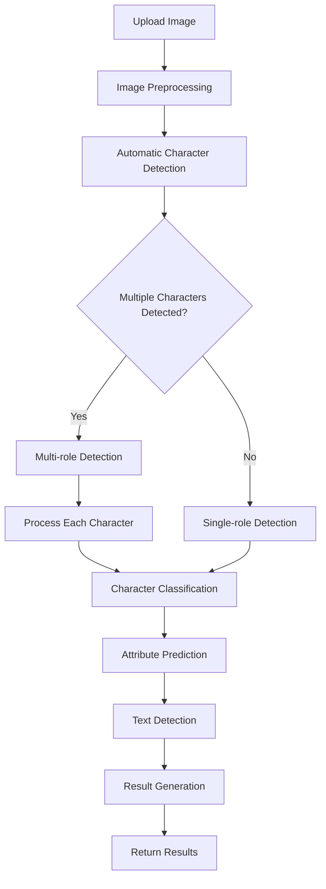

# Character Classification System

## 🎯 System Introduction

The Character Classification System is an AI-based image recognition tool specifically designed to identify characters from games and anime. The system uses advanced deep learning techniques to quickly and accurately identify characters in uploaded images, with support for end-to-end character detection workflows.

## ✨ Key Features

- **Image/Video Recognition**: Supports multiple formats for upload
- **Multi-role Detection**: Automatically detects and identifies multiple characters in a single image
- **High Accuracy**: Uses multiple models including MobileNetV2, EfficientNet-B0, EfficientNet-B3, and ResNet50
- **DeepDanbooru Integration**: Improves classification with anime tag recognition
- **Attribute Prediction**: Predicts character attributes (hair color, eye color, clothing)
- **Real-time Feedback**: Provides recognition confidence and detailed results
- **User-friendly Interface**: Intuitive web interface with model selection
- **API Support**: RESTful API for batch processing and multi-role detection
- **Log Fusion**: Builds new models from classification logs
- **End-to-End Workflow**: Complete process from data collection to model training

## 📊 Model Information

### Supported Models

| Model | Input Size | Training Epochs | Batch Size | Learning Rate | Test Accuracy |
|-------|------------|-----------------|------------|---------------|---------------|
| MobileNetV2 | 224x224 | 50 (early stopping) | 32 | 0.001 | 94.00% |
| EfficientNet-B0 | 224x224 | 50 (early stopping) | 32 | 0.001 | 95.20% |
| EfficientNet-B3 | 300x300 | 50 (early stopping) | 32 | 0.001 | 96.80% |
| ResNet50 | 224x224 | 50 (early stopping) | 32 | 0.001 | 94.80% |

### Training Data
- **Total Samples**: 2,629 images
- **Classes**: 11 characters
- **Training Set**: 2,103 images
- **Validation Set**: 526 images

### Supported Characters
| Character | Samples | Test Precision | Test Recall |
|-----------|---------|----------------|-------------|
| 阿罗娜 (Arona) | 398 | 96.18% | 99.60% |
| 日奈 (Hina) | 55 | 86.44% | 92.73% |
| 普拉娜 (Plana) | 486 | 97.50% | 82.98% |
| 千夏 (Chinatsu) | 25 | 89.47% | 68.00% |
| 亚子 (Ako) | 28 | 89.29% | 89.29% |
| 枫香 (Kaede) | 6 | 100.00% | 83.33% |
| 伊织 (Iori) | 3 | 75.00% | 100.00% |
| 可莉 (Klee) | 226 | - | - |
| 提宝 (Tibao) | 283 | - | - |
| 火花 (Spark) | 412 | - | - |
| 纳西妲 (Nahida) | 707 | - | - |

### Performance
| Model | Test Accuracy | Precision | Recall | F1-Score | Inference Speed (FPS) |
|-------|---------------|-----------|--------|----------|-----------------------|
| MobileNetV2 | 94.00% | 90.55% | 87.99% | 88.60% | 379.34 |
| EfficientNet-B0 | 95.20% | 92.10% | 90.50% | 91.30% | 298.45 |
| EfficientNet-B3 | 96.80% | 94.30% | 93.10% | 93.70% | 187.60 |
| ResNet50 | 94.80% | 91.20% | 89.70% | 90.40% | 256.78 |

## 🚀 Quick Start

### Environment Requirements

- Python 3.7+
- Flask
- PyTorch
- Transformers
- Ultralytics (YOLOv8)
- Faiss
- EfficientNet-B0
- Requests (for DeepDanbooru API integration)

### Install Dependencies

```bash
# Install Flask
pip3 install flask

# Install other dependencies
pip3 install torch torchvision transformers ultralytics faiss-cpu Pillow efficientnet_pytorch requests
```

### Start System

#### 1. Start Backend Service

```bash
# Start backend application
python3 src/backend/api/app.py
```

The backend service will run at `http://127.0.0.1:8000`.

#### 2. Start Frontend Service

```bash
# Enter frontend directory
cd frontend

# Install dependencies (first run)
npm install

# Start Next.js frontend application
npm run dev
```

The frontend service will run at `http://localhost:3000`.

## 📁 Project Structure

```
anime_role_detect/
├── data/                  # Dataset directory
├── models/                # Model storage directory
├── src/                   # Source code
│   ├── backend/           # Backend code
│   ├── core/              # Core functionality
│   ├── data/              # Data-related code
│   ├── frontend/          # Frontend code
│   ├── models/            # Model-related code
│   ├── config/            # Configuration files
│   ├── scripts/           # Utility scripts
│   └── utils/             # Utility functions
├── docs/                  # Detailed documentation
├── cache/                 # Cache directory
├── auto_spider_img/       # Auto spider for images
├── README.md              # Quick start guide
└── README.zh.md           # Chinese documentation
```

## 🌐 Usage

### Web Interface

1. Open your browser and visit `http://localhost:3000`
2. Select a model from the dropdown menu (default: EfficientNet-B0)
3. Check the "Multi-role Detection" box if you want to detect multiple characters in the image
4. Upload an image of the character(s) you want to identify
5. Wait for the system to analyze the image
6. View the recognition result and confidence

### Multi-role Detection

When using multi-role detection:
- The system will automatically detect all characters in the image
- Each character will be identified with its own confidence score
- The results will show the number of detected characters and their positions
- Processing time may be longer for images with multiple characters

### Automatic Detection Flow

The system can automatically determine whether to use single-role or multi-role detection based on the image content. Here's the complete flow:



### How Automatic Detection Works

1. **Image Upload**: User uploads an image through the web interface or API
2. **Preprocessing**: Image is compressed and validated
3. **Character Detection**: System automatically detects if there are multiple characters in the image
4. **Detection Mode Selection**: Based on the number of detected characters, the system selects the appropriate detection mode
5. **Character Classification**: Each character is classified using the selected model
6. **Attribute Prediction**: Character attributes (hair color, eye color, clothing) are predicted
7. **Text Detection**: Any text in the image is detected
8. **Result Generation**: Results are compiled and returned to the user

### API Call

```bash
# Basic usage (auto-detection)
curl -X POST -F "file=@path/to/image.jpg" http://127.0.0.1:8000/api/classify

# With model and attributes
curl -X POST -F "file=@path/to/image.jpg" -F "use_model=true" -F "use_attributes=true" -F "model_name=efficientnet_b0" http://127.0.0.1:8000/api/classify

# Multi-role detection (force)
curl -X POST -F "file=@path/to/image.jpg" -F "model_name=efficientnet_b0" http://127.0.0.1:8000/api/classify/multi-role
```

## � Documentation

For detailed technical documentation, please refer to the `docs/` directory:

- **docs/technical_guide.md**: Complete technical documentation

## 🤝 Contribution

Welcome to submit Issues and Pull Requests to improve system performance and functionality.

## 📄 License

This project is open source under the MIT license.

## 📞 Contact

- Email: zhaoqi.cao@icloud.com
- GitHub: https://github.com/caozhaoqi/anime-role-detect

## ☸️ Kubernetes Deployment

### Prerequisites

- Kubernetes cluster (Minikube, Kind, or production cluster)
- Docker
- kubectl

### Docker Images

#### Backend API

```Dockerfile
# Dockerfile for backend API
FROM python:3.9-slim

WORKDIR /app

COPY requirements.txt .
RUN pip install --no-cache-dir -r requirements.txt

COPY src/backend/ ./backend/
COPY src/core/ ./core/
COPY src/utils/ ./utils/

EXPOSE 8000

CMD ["python", "backend/api/run_api.py"]
```

#### Frontend

```Dockerfile
# Dockerfile for frontend
FROM nginx:alpine

COPY src/frontend/ /usr/share/nginx/html

EXPOSE 80

CMD ["nginx", "-g", "daemon off;"]
```

### Kubernetes Configuration

#### Backend Deployment

```yaml
# backend-deployment.yaml
apiVersion: apps/v1
kind: Deployment
metadata:
  name: character-classification-backend
  labels:
    app: character-classification
    component: backend
spec:
  replicas: 2
  selector:
    matchLabels:
      app: character-classification
      component: backend
  template:
    metadata:
      labels:
        app: character-classification
        component: backend
    spec:
      containers:
      - name: backend
        image: character-classification-backend:latest
        ports:
        - containerPort: 8000
        resources:
          limits:
            cpu: "2"
            memory: "4Gi"
          requests:
            cpu: "1"
            memory: "2Gi"
```

#### Frontend Deployment

```yaml
# frontend-deployment.yaml
apiVersion: apps/v1
kind: Deployment
metadata:
  name: character-classification-frontend
  labels:
    app: character-classification
    component: frontend
spec:
  replicas: 2
  selector:
    matchLabels:
      app: character-classification
      component: frontend
  template:
    metadata:
      labels:
        app: character-classification
        component: frontend
    spec:
      containers:
      - name: frontend
        image: character-classification-frontend:latest
        ports:
        - containerPort: 80
        resources:
          limits:
            cpu: "1"
            memory: "512Mi"
          requests:
            cpu: "500m"
            memory: "256Mi"
```

#### Services

```yaml
# services.yaml
apiVersion: v1
kind: Service
metadata:
  name: character-classification-backend
spec:
  selector:
    app: character-classification
    component: backend
  ports:
  - port: 8000
    targetPort: 8000
  type: ClusterIP
---
apiVersion: v1
kind: Service
metadata:
  name: character-classification-frontend
spec:
  selector:
    app: character-classification
    component: frontend
  ports:
  - port: 80
    targetPort: 80
  type: LoadBalancer
```

### Deployment Steps

1. **Build Docker images**
   ```bash
   # Build backend image
   docker build -t character-classification-backend:latest -f Dockerfile.backend .
   
   # Build frontend image
   docker build -t character-classification-frontend:latest -f Dockerfile.frontend .
   ```

2. **Push images to registry** (if using a remote cluster)
   ```bash
   docker tag character-classification-backend:latest <registry>/character-classification-backend:latest
   docker tag character-classification-frontend:latest <registry>/character-classification-frontend:latest
   docker push <registry>/character-classification-backend:latest
   docker push <registry>/character-classification-frontend:latest
   ```

3. **Deploy to Kubernetes**
   ```bash
   kubectl apply -f backend-deployment.yaml
   kubectl apply -f frontend-deployment.yaml
   kubectl apply -f services.yaml
   ```

4. **Verify deployment**
   ```bash
   kubectl get pods
   kubectl get services
   ```

5. **Access the application**
   - Frontend: Use the LoadBalancer IP or hostname
   - Backend API: Use the ClusterIP or port-forwarding

### Monitoring

To monitor the application in Kubernetes, you can integrate Prometheus and Grafana:

1. **Install Prometheus and Grafana**
   ```bash
   helm repo add prometheus-community https://prometheus-community.github.io/helm-charts
   helm install prometheus prometheus-community/kube-prometheus-stack
   ```

2. **Configure custom metrics**
   - Add Prometheus annotations to your deployments
   - Create custom dashboards in Grafana

### Scaling

To scale the application based on traffic:

1. **Horizontal Pod Autoscaler**
   ```yaml
   apiVersion: autoscaling/v2
   kind: HorizontalPodAutoscaler
   metadata:
     name: character-classification-backend-hpa
   spec:
     scaleTargetRef:
       apiVersion: apps/v1
       kind: Deployment
       name: character-classification-backend
     minReplicas: 2
     maxReplicas: 10
     metrics:
     - type: Resource
       resource:
         name: cpu
         target:
           type: Utilization
           averageUtilization: 70
   ```

2. **Apply HPA**
   ```bash
   kubectl apply -f hpa.yaml
   ```

---

**© 2026 Character Classification System** - Making character recognition simple!

