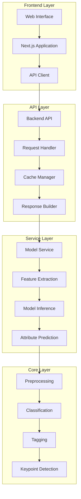
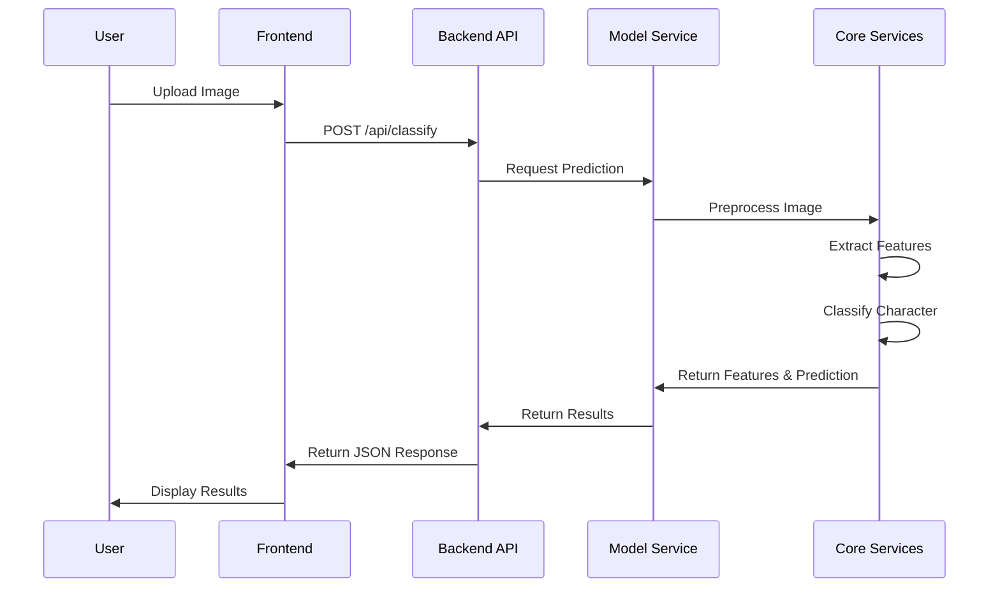
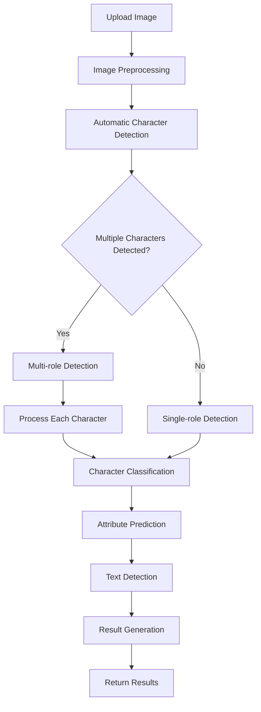

# Character Classification System

## 🎯 System Introduction

The Character Classification System is an AI-based image recognition tool specifically designed to identify characters from games and anime. The system uses advanced deep learning techniques to quickly and accurately identify characters in uploaded images, with support for end-to-end character detection workflows.

## ✨ Key Features

- **Image/Video Recognition**: Supports multiple formats for upload
- **Multi-role Detection**: Automatically detects and identifies multiple characters in a single image
- **High Accuracy**: Uses multiple models including MobileNetV2, EfficientNet-B0, EfficientNet-B3, and ResNet50
- **DeepDanbooru Integration**: Improves classification with anime tag recognition
- **Attribute Prediction**: Predicts character attributes (hair color, eye color, clothing)
- **Real-time Feedback**: Provides recognition confidence and detailed results
- **User-friendly Interface**: Intuitive web interface with model selection
- **API Support**: RESTful API for batch processing and multi-role detection
- **Log Fusion**: Builds new models from classification logs
- **End-to-End Workflow**: Complete process from data collection to model training
- **Memory Optimization**: Dynamic model loading/unloading, singleton pattern, reduced memory usage
- **Layered Deployment Architecture**: Supports deploying services on different servers for better scalability

## 📊 Model Information

### Supported Models

| Model | Input Size | Training Epochs | Batch Size | Learning Rate | Test Accuracy |
|-------|------------|-----------------|------------|---------------|---------------|
| MobileNetV2 | 224x224 | 50 (early stopping) | 32 | 0.001 | 94.00% |
| EfficientNet-B0 | 224x224 | 50 (early stopping) | 32 | 0.001 | 95.20% |
| EfficientNet-B3 | 300x300 | 50 (early stopping) | 32 | 0.001 | 96.80% |
| ResNet50 | 224x224 | 50 (early stopping) | 32 | 0.001 | 94.80% |

### Training Data
- **Total Samples**: 2,629 images
- **Classes**: 11 characters
- **Training Set**: 2,103 images
- **Validation Set**: 526 images

### Supported Characters
| Character | Samples | Test Precision | Test Recall |
|-----------|---------|----------------|-------------|
| 阿罗娜 (Arona) | 398 | 96.18% | 99.60% |
| 日奈 (Hina) | 55 | 86.44% | 92.73% |
| 普拉娜 (Plana) | 486 | 97.50% | 82.98% |
| 千夏 (Chinatsu) | 25 | 89.47% | 68.00% |
| 亚子 (Ako) | 28 | 89.29% | 89.29% |
| 枫香 (Kaede) | 6 | 100.00% | 83.33% |
| 伊织 (Iori) | 3 | 75.00% | 100.00% |
| 可莉 (Klee) | 226 | - | - |
| 提宝 (Tibao) | 283 | - | - |
| 火花 (Spark) | 412 | - | - |
| 纳西妲 (Nahida) | 707 | - | - |

### Performance
| Model | Test Accuracy | Precision | Recall | F1-Score | Inference Speed (FPS) |
|-------|---------------|-----------|--------|----------|-----------------------|
| MobileNetV2 | 94.00% | 90.55% | 87.99% | 88.60% | 379.34 |
| EfficientNet-B0 | 95.20% | 92.10% | 90.50% | 91.30% | 298.45 |
| EfficientNet-B3 | 96.80% | 94.30% | 93.10% | 93.70% | 187.60 |
| ResNet50 | 94.80% | 91.20% | 89.70% | 90.40% | 256.78 |

## 🚀 Quick Start

### Environment Requirements

- Python 3.7+
- FastAPI
- Uvicorn
- PyTorch
- Transformers
- Ultralytics (YOLOv8)
- Faiss
- EfficientNet-B0
- Requests (for DeepDanbooru API integration)

### Install Dependencies

```bash
# Install FastAPI and Uvicorn
pip3 install fastapi uvicorn python-multipart

# Install other dependencies
pip3 install torch torchvision transformers ultralytics faiss-cpu Pillow efficientnet_pytorch requests
```

### Start System

#### 1. Start Model Service

```bash
# Start model service
python3 src/backend/services/model_service/app.py
```

The model service will run at `http://127.0.0.1:8001`.

#### 2. Start Backend API Service

```bash
# Start backend API service
python3 src/backend/api/run_api.py
```

The backend API service will run at `http://127.0.0.1:8000`.

#### 3. Start Frontend Service

```bash
# Enter frontend directory
cd src/frontend

# Install dependencies (first run)
npm install

# Start Next.js frontend application
npm run dev
```

The frontend service will run at `http://localhost:3000`.

## 📁 Project Structure

```
anime_role_detect/
├── data/                  # Dataset directory
├── models/                # Model storage directory
├── src/                   # Source code
│   ├── backend/           # Backend code
│   ├── core/              # Core functionality
│   ├── data/              # Data-related code
│   ├── frontend/          # Frontend code
│   ├── models/            # Model-related code
│   ├── config/            # Configuration files
│   ├── scripts/           # Utility scripts
│   └── utils/             # Utility functions
├── docs/                  # Detailed documentation
├── cache/                 # Cache directory
├── auto_spider_img/       # Auto spider for images
├── README.md              # Quick start guide
└── README.zh.md           # Chinese documentation
```

## 🏗️ System Architecture

### Layered Architecture

The system adopts a layered architecture design, separating different functional modules to improve system maintainability and scalability.



### Data Flow Diagram

The data flow through the system follows a clear path from image upload to result generation:



### Architecture Overview

The system architecture is designed to support distributed deployment, with each service able to run independently on different servers:

1. **Frontend Layer**:
   - Next.js application with responsive design
   - User interface for image upload and result display
   - API client for communicating with backend

2. **API Layer**:
   - FastAPI-based RESTful API
   - Request handling and response building
   - Cache management for improved performance

3. **Service Layer**:
   - Model service for core prediction functionality
   - Feature extraction and model inference
   - Attribute prediction and text detection

4. **Core Layer**:
   - Preprocessing and image validation
   - Classification models and algorithms
   - Tagging and keypoint detection

This layered architecture allows for easy scaling and maintenance, with each layer responsible for specific functionality. The services communicate through well-defined API interfaces, enabling independent deployment and scaling.

## �🌐 Usage

### Web Interface

1. Open your browser and visit `http://localhost:3000`
2. Select a model from the dropdown menu (default: EfficientNet-B0)
3. Check the "Multi-role Detection" box if you want to detect multiple characters in the image
4. Upload an image of the character(s) you want to identify
5. Wait for the system to analyze the image
6. View the recognition result and confidence

### Multi-role Detection

When using multi-role detection:
- The system will automatically detect all characters in the image
- Each character will be identified with its own confidence score
- The results will show the number of detected characters and their positions
- Processing time may be longer for images with multiple characters

### Automatic Detection Flow

The system can automatically determine whether to use single-role or multi-role detection based on the image content. Here's the complete flow:



### How Automatic Detection Works

1. **Image Upload**: User uploads an image through the web interface or API
2. **Preprocessing**: Image is compressed and validated
3. **Character Detection**: System automatically detects if there are multiple characters in the image
4. **Detection Mode Selection**: Based on the number of detected characters, the system selects the appropriate detection mode
5. **Character Classification**: Each character is classified using the selected model
6. **Attribute Prediction**: Character attributes (hair color, eye color, clothing) are predicted
7. **Text Detection**: Any text in the image is detected
8. **Result Generation**: Results are compiled and returned to the user

### API Call

```bash
# Basic usage (auto-detection)
curl -X POST -F "file=@path/to/image.jpg" http://127.0.0.1:8000/api/classify

# With model and attributes
curl -X POST -F "file=@path/to/image.jpg" -F "use_model=true" -F "use_attributes=true" -F "model_name=efficientnet_b0" http://127.0.0.1:8000/api/classify

# Multi-role detection (force)
curl -X POST -F "file=@path/to/image.jpg" -F "model_name=efficientnet_b0" http://127.0.0.1:8000/api/classify/multi-role
```

## � Documentation

For detailed technical documentation, please refer to the `docs/` directory:

- **docs/technical_guide.md**: Complete technical documentation

## 🤝 Contribution

Welcome to submit Issues and Pull Requests to improve system performance and functionality.

## 📄 License

This project is open source under the MIT license.

## 📞 Contact

- Email: zhaoqi.cao@icloud.com
- GitHub: https://github.com/caozhaoqi/anime-role-detect