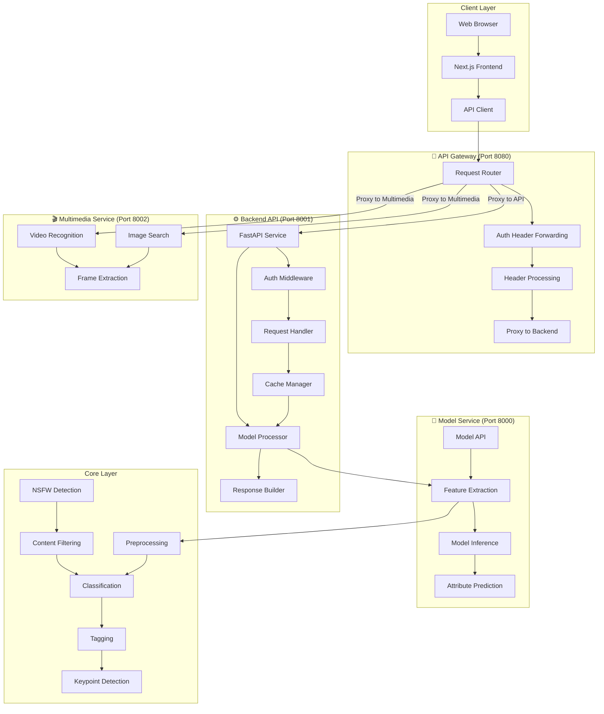
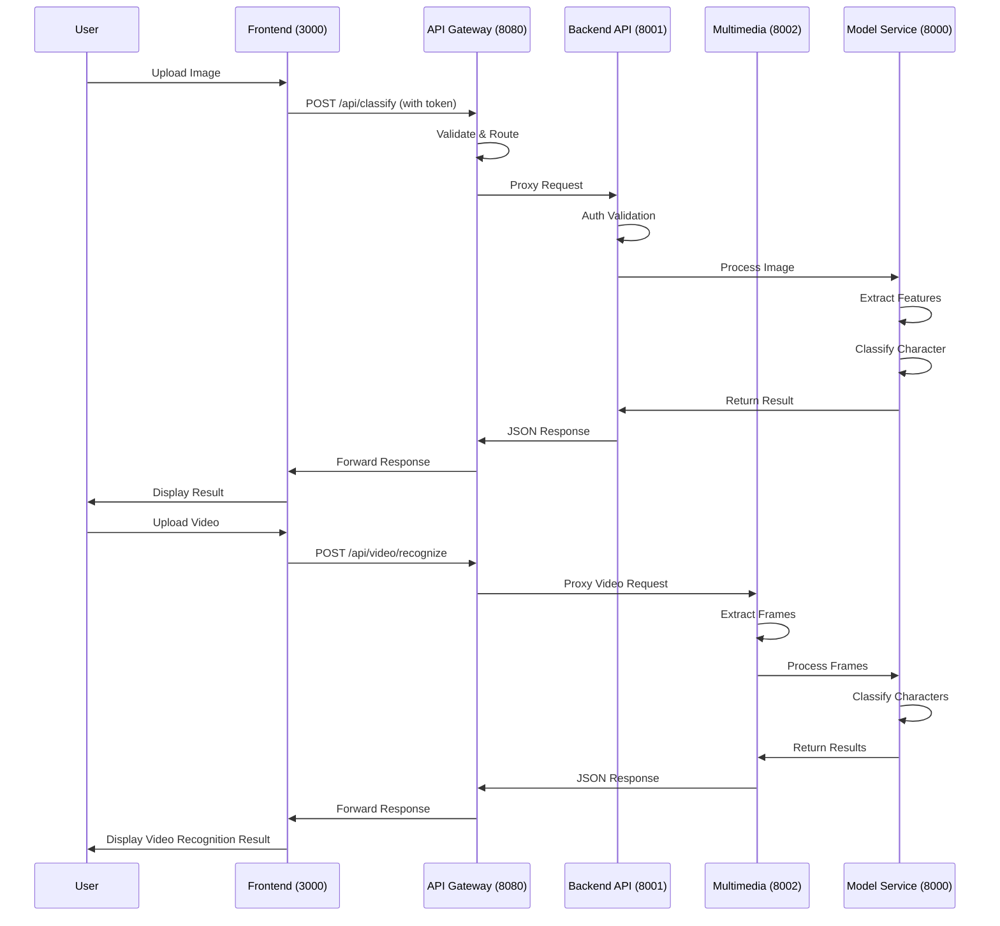

# Character Classification System

## 🎯 System Introduction

The Character Classification System is an AI-based image recognition tool specifically designed to identify characters from games and anime. The system uses advanced deep learning techniques to quickly and accurately identify characters in uploaded images, with support for end-to-end character detection workflows.

## ✨ Key Features

- **Image/Video Recognition**: Supports multiple formats for upload
- **Multi-role Detection**: Automatically detects and identifies multiple characters in a single image
- **High Accuracy**: Uses multiple models including MobileNetV2, EfficientNet-B0, EfficientNet-B3, and ResNet50
- **DeepDanbooru Integration**: Improves classification with anime tag recognition
- **Attribute Prediction**: Predicts character attributes (hair color, eye color, clothing)
- **Real-time Feedback**: Provides recognition confidence and detailed results
- **User-friendly Interface**: Intuitive web interface with model selection
- **API Support**: RESTful API for batch processing and multi-role detection
- **Log Fusion**: Builds new models from classification logs
- **End-to-End Workflow**: Complete process from data collection to model training
- **Memory Optimization**: Dynamic model loading/unloading, singleton pattern, reduced memory usage
- **Layered Deployment Architecture**: Supports deploying services on different servers for better scalability
- **API Gateway**: Unified entry point for all API requests with proxy routing

## 📊 Model Information

### Supported Models

| Model | Input Size | Training Epochs | Batch Size | Learning Rate | Test Accuracy |
|-------|------------|-----------------|------------|---------------|---------------|
| MobileNetV2 | 224x224 | 50 (early stopping) | 32 | 0.001 | 94.00% |
| EfficientNet-B0 | 224x224 | 50 (early stopping) | 32 | 0.001 | 95.20% |
| EfficientNet-B3 | 300x300 | 50 (early stopping) | 32 | 0.001 | 96.80% |
| ResNet50 | 224x224 | 50 (early stopping) | 32 | 0.001 | 94.80% |


### Performance
| Model | Test Accuracy | Precision | Recall | F1-Score | Inference Speed (FPS) |
|-------|---------------|-----------|--------|----------|-----------------------|
| MobileNetV2 | 94.00% | 90.55% | 87.99% | 88.60% | 379.34 |
| EfficientNet-B0 | 95.20% | 92.10% | 90.50% | 91.30% | 298.45 |
| EfficientNet-B3 | 96.80% | 94.30% | 93.10% | 93.70% | 187.60 |
| ResNet50 | 94.80% | 91.20% | 89.70% | 90.40% | 256.78 |

## 🚀 Quick Start

### Hardware Requirements

| Component | Minimum | Recommended |
|-----------|---------|-------------|
| **RAM** | 16GB | 32GB+ |
| **GPU** | None (CPU-only) | NVIDIA GPU with ≥4GB VRAM |
| **Storage** | 10GB | 50GB+ (for dataset and models) |

> **Important**: Due to the memory requirements of loading YOLO and multiple classification models, **16GB RAM is the minimum requirement**. Running on machines with 8GB or less may cause OOM (Out of Memory) errors.

### Environment Requirements

- Python 3.9+
- FastAPI
- Uvicorn
- PyTorch
- Transformers
- Ultralytics (YOLOv8)
- Faiss
- EfficientNet-Python
- Requests (for DeepDanbooru API integration)
- Node.js 16+ (for frontend)

### Install Dependencies

```bash
pip3 install fastapi uvicorn python-multipart httpx
pip3 install torch torchvision transformers ultralytics faiss-cpu Pillow efficientnet_pytorch requests
```

### Docker Deployment (Recommended)

The system is fully containerized. To run with Docker:

```bash
# Clone the repository
git clone https://github.com/caozhaoqi/anime-role-detect.git
cd anime-role-detect

# Build and start all services
docker-compose up --build -d

# Check service status
docker-compose ps
```

**Service Ports after Docker deployment:**
- **API Gateway**: `http://localhost:8080`
- **Frontend**: `http://localhost:3000`
- **Backend API**: `http://localhost:8001`
- **Multimedia Service**: `http://localhost:8002`
- **Model Service**: `http://localhost:8000`

### Model Download

The pre-trained models are required for character recognition. Please download the model weights and place them in the `models/` directory:

1. Download model weights from [Google Drive](https://drive.google.com/drive/folders/XXX)
2. Extract and place `.pt` files in `models/` directory

**Required models:**
- YOLOv8 face detection model
- EfficientNet-B0 classification model
- EfficientNet-B3 classification model
- MobileNetV2 classification model
- ResNet50 classification model

### Start System

#### 1. Start Core Services (Recommended)

```bash
python3 src/application.py start --core
```

This will start all core services:
- **Multimedia Service**: `http://127.0.0.1:8002`
- **API Service**: `http://127.0.0.1:8001`

#### 2. Start API Gateway (Main Entry Point)

```bash
python3 src/application.py start --services gateway
```

The API Gateway will run at `http://127.0.0.1:8080`. **All API requests must go through this gateway.**

#### 3. Start Frontend Service

```bash
cd src/frontend
npm install
npm run dev
```

The frontend service will run at `http://localhost:3000`.

## 📁 Project Structure

```
anime_role_detect/
├── data/                      # Dataset directory
├── models/                    # Model storage directory
├── src/                       # Source code
│   ├── api/                   # Backend API service (port 8001)
│   ├── core/                  # Core functionality
│   ├── frontend/              # Frontend code (Next.js)
│   │   └── app/               # API routes and components
│   ├── middleware/            # Middleware
│   ├── services/              # Service layer
│   │   ├── api_gateway/       # API Gateway service (port 8080)
│   │   ├── multimedia/        # Multimedia service (port 8002)
│   │   │   ├── image_search/  # Image search functionality
│   │   │   └── video_recognize/ # Video recognition functionality
│   │   ├── model_service/     # Model service (port 8000)
│   │   ├── auth_service/      # Authentication service
│   │   ├── cache_service/     # Cache service
│   │   └── processor/         # Image/text processing
│   ├── config/                # Configuration files
│   ├── scripts/               # Utility scripts
│   └── utils/                 # Utility functions
```

## 🏗️ System Architecture

### Layered Architecture

The system adopts a layered architecture design with API Gateway as the unified entry point:



### Service Communication Flow



### Architecture Overview

The system architecture is designed to support distributed deployment with **API Gateway as the single entry point**:

1. **Client Layer**:
   - Next.js application with responsive design and dark mode support
   - User interface for image/video upload, model selection, and result display
   - User authentication interface with login form
   - API client for communicating with backend services via Gateway

2. **Gateway Layer (Port 8080)**:
   - **API Gateway** - **Unified entry point for ALL API requests**
   - Request routing based on path prefix:
     - `/api/search/*` → Multimedia Service (8002)
     - `/api/video/*` → Multimedia Service (8002)
     - `/api/classify/*` → Backend API (8001)
     - `/api/model/*` → Model Service (8000)
     - Other requests → Backend API (8001)
   - Authentication header forwarding
   - Header processing (content-type, content-length management)
   - Bypasses system proxy (trust_env=False) for localhost communication

3. **Backend Layer (Port 8001)**:
   - FastAPI-based RESTful API
   - Request handling and response building
   - Authentication middleware for token validation
   - Cache management for improved performance
   - Business logic and model coordination

4. **Multimedia Layer (Port 8002)**:
   - Image search functionality using FAISS
   - Video recognition with frame extraction
   - Multimedia processing and analysis
   - Integration with model service for character classification

5. **Model Layer (Port 8000)**:
   - Core prediction functionality
   - Feature extraction and model inference
   - Attribute prediction and text detection
   - Model loading and management
   - Multiple model support (EfficientNet, ResNet, MobileNet)

6. **Core Layer**:
   - Preprocessing and image validation
   - Classification models and algorithms
   - Tagging and keypoint detection
   - NSFW detection for content filtering
   - DeepDanbooru integration for anime tag recognition

### System Detection Flow

1. **Image Upload**: User uploads image through web interface
2. **Preprocessing**: Image is compressed and validated
3. **Character Detection**: System detects if there are multiple characters
4. **Character Classification**: Each character is classified using selected model
5. **Attribute Prediction**: Character attributes are predicted
6. **Result Generation**: Results are compiled and returned

## 🌐 Usage

### Web Interface

1. Open your browser and visit `http://localhost:3000`
2. Login with your credentials
3. Select a model from the dropdown menu
4. Choose the function tab: Character Recognition, Image Search, or Video Recognition
5. Check the "Multi-role Detection" box if needed
6. Upload an image/video of the character(s) you want to identify
7. Wait for the system to analyze
8. View the recognition result and confidence

### API Endpoints

**All API requests MUST be sent to the API Gateway (port 8080)**:

| Endpoint | Method | Description | Auth |
|----------|--------|-------------|------|
| `/` | GET | Root info | No |
| `/api/health` | GET | Gateway health check | No |
| `/api/services` | GET | Service status | No |
| `/api/auth/login` | POST | User login | No |
| `/api/classify` | POST | Image classification | Yes |
| `/api/classify/multi-role` | POST | Multi-role detection | Yes |
| `/api/search/image` | POST | Image search | Yes |
| `/api/video/recognize` | POST | Video recognition | Yes |
| `/api/history` | GET | Recognition history | Yes |
| `/api/models` | GET | Available models | Yes |

### API Call Examples

```bash
# Health check
curl http://127.0.0.1:8080/api/health

# Service status
curl http://127.0.0.1:8080/api/services

# Login
curl -X POST -F "username=admin" -F "password=admin123" http://127.0.0.1:8080/api/auth/login

# Image classification (with token)
curl -X POST -F "file=@path/to/image.jpg" \
     -F "model_name=efficientnet_b0_loli_reorganized" \
     -F "use_model=true" \
     -F "use_attributes=true" \
     -H "Authorization: Bearer YOUR_TOKEN" \
     http://127.0.0.1:8080/api/classify

# Multi-role detection
curl -X POST -F "file=@path/to/image.jpg" \
     -F "model_name=efficientnet_b0_loli_reorganized" \
     -H "Authorization: Bearer YOUR_TOKEN" \
     http://127.0.0.1:8080/api/classify/multi-role

# Image search
curl -X POST -F "file=@path/to/image.jpg" \
     -H "Authorization: Bearer YOUR_TOKEN" \
     http://127.0.0.1:8080/api/search/image

# Video recognition
curl -X POST -F "file=@path/to/video.mp4" \
     -F "frame_interval=1" \
     -F "confidence_threshold=0.5" \
     -H "Authorization: Bearer YOUR_TOKEN" \
     http://127.0.0.1:8080/api/video/recognize
```

## 🔧 Configuration

### Service Ports

| Service | Default Port | Environment Variable |
|---------|-------------|---------------------|
| API Gateway | 8080 | - |
| Backend API | 8001 | `BACKEND_PORT` |
| Multimedia Service | 8002 | - |
| Model Service | 8000 | `MODEL_SERVICE_PORT` |
| Frontend | 3000 | `FRONTEND_PORT` |

### Important Notes

- **API Gateway (port 8080)** must be started before other services for proper routing
- **All frontend requests must go through the API Gateway**, no direct access to backend services
- The gateway uses `trust_env=False` to bypass system proxy for localhost communication
- Temp directory (`temp/`) must exist for image/video processing
- All backend services can run on different servers with proper gateway configuration

## 📚 Documentation

For detailed technical documentation, please refer to the `docs/` directory:

- **docs/technical_guide.md**: Complete technical documentation
- **docs/architecture/**: Architecture documentation

## 🤝 Contribution

Welcome to submit Issues and Pull Requests to improve system performance and functionality.

## 📄 License

This project is open source under the MIT license.

## 📞 Contact

- Email: zhaoqi.cao@icloud.com
- GitHub: https://github.com/caozhaoqi/anime-role-detect