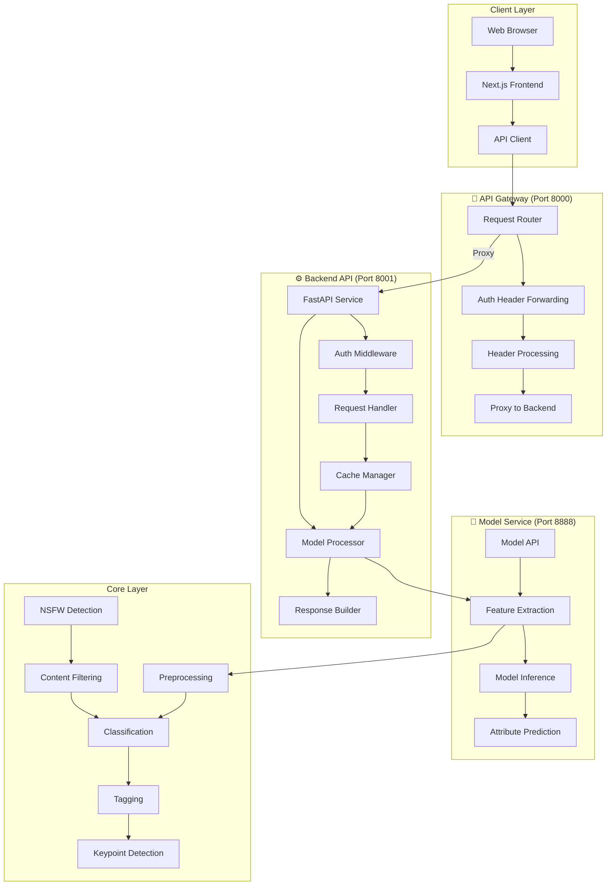
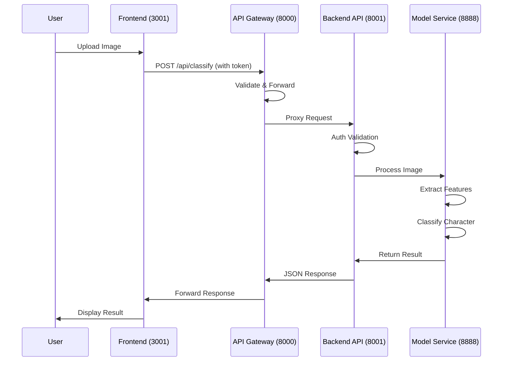

# Character Classification System

## 🎯 System Introduction

The Character Classification System is an AI-based image recognition tool specifically designed to identify characters from games and anime. The system uses advanced deep learning techniques to quickly and accurately identify characters in uploaded images, with support for end-to-end character detection workflows.

## ✨ Key Features

- **Image/Video Recognition**: Supports multiple formats for upload
- **Multi-role Detection**: Automatically detects and identifies multiple characters in a single image
- **High Accuracy**: Uses multiple models including MobileNetV2, EfficientNet-B0, EfficientNet-B3, and ResNet50
- **DeepDanbooru Integration**: Improves classification with anime tag recognition
- **Attribute Prediction**: Predicts character attributes (hair color, eye color, clothing)
- **Real-time Feedback**: Provides recognition confidence and detailed results
- **User-friendly Interface**: Intuitive web interface with model selection
- **API Support**: RESTful API for batch processing and multi-role detection
- **Log Fusion**: Builds new models from classification logs
- **End-to-End Workflow**: Complete process from data collection to model training
- **Memory Optimization**: Dynamic model loading/unloading, singleton pattern, reduced memory usage
- **Layered Deployment Architecture**: Supports deploying services on different servers for better scalability
- **API Gateway**: Unified entry point for all API requests with proxy routing

## 📊 Model Information

### Supported Models

| Model | Input Size | Training Epochs | Batch Size | Learning Rate | Test Accuracy |
|-------|------------|-----------------|------------|---------------|---------------|
| MobileNetV2 | 224x224 | 50 (early stopping) | 32 | 0.001 | 94.00% |
| EfficientNet-B0 | 224x224 | 50 (early stopping) | 32 | 0.001 | 95.20% |
| EfficientNet-B3 | 300x300 | 50 (early stopping) | 32 | 0.001 | 96.80% |
| ResNet50 | 224x224 | 50 (early stopping) | 32 | 0.001 | 94.80% |


### Performance
| Model | Test Accuracy | Precision | Recall | F1-Score | Inference Speed (FPS) |
|-------|---------------|-----------|--------|----------|-----------------------|
| MobileNetV2 | 94.00% | 90.55% | 87.99% | 88.60% | 379.34 |
| EfficientNet-B0 | 95.20% | 92.10% | 90.50% | 91.30% | 298.45 |
| EfficientNet-B3 | 96.80% | 94.30% | 93.10% | 93.70% | 187.60 |
| ResNet50 | 94.80% | 91.20% | 89.70% | 90.40% | 256.78 |

## 🚀 Quick Start

### Environment Requirements

- Python 3.9+
- FastAPI
- Uvicorn
- PyTorch
- Transformers
- Ultralytics (YOLOv8)
- Faiss
- EfficientNet-Python
- Requests (for DeepDanbooru API integration)
- Node.js 16+ (for frontend)

### Install Dependencies

```bash
pip3 install fastapi uvicorn python-multipart httpx
pip3 install torch torchvision transformers ultralytics faiss-cpu Pillow efficientnet_pytorch requests
```

### Start System

#### 1. Start API Gateway (Main Entry Point)

```bash
python3 -m uvicorn src.services.api_gateway.app:app --host 0.0.0.0 --port 8000
```

The API Gateway will run at `http://127.0.0.1:8000`. All API requests should be sent to this gateway.

#### 2. Start Backend API Service

```bash
python3 -m uvicorn src.api.app:app --host 0.0.0.0 --port 8001
```

The backend API service will run at `http://127.0.0.1:8001`.

#### 3. Start Model Service (Optional)

```bash
python3 -m uvicorn src.services.model_service.app:app --host 0.0.0.0 --port 8888
```

The model service will run at `http://127.0.0.1:8888`.

#### 4. Start Frontend Service

```bash
cd src/frontend
npm install
npm run dev
```

The frontend service will run at `http://localhost:3001`.

## 📁 Project Structure

```
anime_role_detect/
├── data/                      # Dataset directory
├── models/                    # Model storage directory
├── src/                       # Source code
│   ├── api/                   # Backend API service (port 8001)
│   ├── core/                  # Core functionality
│   ├── frontend/               # Frontend code (Next.js)
│   │   └── app/                # API routes
│   ├── middleware/             # Middleware
│   ├── services/               # Service layer
│   │   ├── api_gateway/         # API Gateway service (port 8000)
│   │   ├── model_service/       # Model service (port 8888)
│   │   ├── auth_service/        # Authentication service
│   │   ├── cache_service/        # Cache service
│   │   └── processor/            # Image/text processing
│   ├── config/                 # Configuration files
│   ├── scripts/                # Utility scripts
│   └── utils/                  # Utility functions
├── temp/                      # Temporary file storage
├── docs/                      # Detailed documentation
├── cache/                     # Cache directory
├── auto_spider_img/           # Auto spider for images
├── test_gateway.py            # API Gateway test script
├── README.md                  # English documentation
└── README.zh.md              # Chinese documentation
```

## 🏗️ System Architecture

### Layered Architecture

The system adopts a layered architecture design with API Gateway as the unified entry point:



### Service Communication Flow



### Architecture Overview

The system architecture is designed to support distributed deployment:

1. **Client Layer**:
   - Next.js application with responsive design and dark mode support
   - User interface for image upload, model selection, and result display
   - User authentication interface with login form
   - API client for communicating with backend services

2. **Gateway Layer (Port 8000)**:
   - **API Gateway** - Unified entry point for all API requests
   - Request routing and proxying to backend services
   - Authentication header forwarding
   - Header processing (content-type, content-length management)
   - Bypasses system proxy (trust_env=False) for localhost communication

3. **Backend Layer (Port 8001)**:
   - FastAPI-based RESTful API
   - Request handling and response building
   - Authentication middleware for token validation
   - Cache management for improved performance
   - Business logic and model coordination

4. **Model Layer (Port 8888)**:
   - Core prediction functionality
   - Feature extraction and model inference
   - Attribute prediction and text detection
   - Model loading and management

5. **Core Layer**:
   - Preprocessing and image validation
   - Classification models and algorithms
   - Tagging and keypoint detection
   - NSFW detection for content filtering

### System Detection Flow

1. **Image Upload**: User uploads image through web interface
2. **Preprocessing**: Image is compressed and validated
3. **Character Detection**: System detects if there are multiple characters
4. **Character Classification**: Each character is classified using selected model
5. **Attribute Prediction**: Character attributes are predicted
6. **Result Generation**: Results are compiled and returned

## 🌐 Usage

### Web Interface

1. Open your browser and visit `http://localhost:3001`
2. Login with your credentials
3. Select a model from the dropdown menu (default: resnet18_loli8)
4. Check the "Multi-role Detection" box if needed
5. Upload an image of the character(s) you want to identify
6. Wait for the system to analyze the image
7. View the recognition result and confidence

### API Endpoints

All API requests should be sent to the **API Gateway (port 8000)**:

| Endpoint | Method | Description | Auth |
|----------|--------|-------------|------|
| `/` | GET | Root info | No |
| `/api/health` | GET | Gateway health check | No |
| `/api/services` | GET | Service status | No |
| `/api/auth/login` | POST | User login | No |
| `/api/classify` | POST | Image classification | Yes |
| `/api/history` | GET | Recognition history | Yes |
| `/api/model/health` | GET | Model service health | No |

### API Call Examples

```bash
# Health check
curl http://127.0.0.1:8000/api/health

# Service status
curl http://127.0.0.1:8000/api/services

# Login
curl -X POST -F "username=admin" -F "password=admin123" http://127.0.0.1:8000/api/auth/login

# Image classification (with token)
curl -X POST -F "file=@path/to/image.jpg" \
     -F "model_name=resnet18_loli8" \
     -F "use_model=true" \
     -F "use_attributes=true" \
     -H "Authorization: Bearer YOUR_TOKEN" \
     http://127.0.0.1:8000/api/classify

# Multi-role detection
curl -X POST -F "file=@path/to/image.jpg" \
     -F "model_name=resnet18_loli8" \
     -F "multi_role=true" \
     -H "Authorization: Bearer YOUR_TOKEN" \
     http://127.0.0.1:8000/api/classify
```

## 🔧 Configuration

### Service Ports

| Service | Default Port | Environment Variable |
|---------|-------------|---------------------|
| API Gateway | 8000 | - |
| Backend API | 8001 | `BACKEND_PORT` |
| Model Service | 8888 | `MODEL_SERVICE_PORT` |
| Frontend | 3001 | `FRONTEND_PORT` |

### Important Notes

- **API Gateway** must be started before other services for proper routing
- The gateway uses `trust_env=False` to bypass system proxy for localhost communication
- Temp directory (`temp/`) must exist for image processing
- Backend API and Model Service can run on different servers

## 📚 Documentation

For detailed technical documentation, please refer to the `docs/` directory:

- **docs/technical_guide.md**: Complete technical documentation
- **docs/architecture/**: Architecture documentation

## 🤝 Contribution

Welcome to submit Issues and Pull Requests to improve system performance and functionality.

## 📄 License

This project is open source under the MIT license.

## 📞 Contact

- Email: zhaoqi.cao@icloud.com
- GitHub: https://github.com/caozhaoqi/anime-role-detect