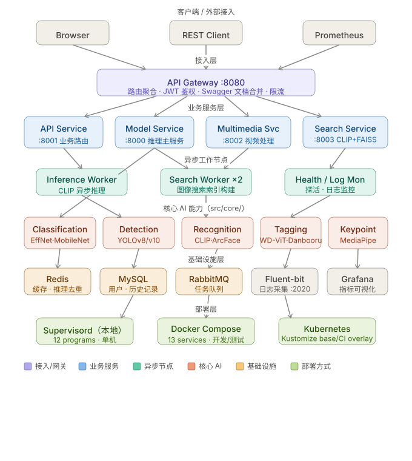

# 角色分类系统


基于人工智能的图片识别系统，专门用于识别游戏和动漫中的角色。

## ✨ 核心功能

- **多格式识别**: 支持图片和视频
- **多角色检测**: 识别单张图片中的多个角色（集成YOLOv8/v10）
- **高准确率**: 基于 MobileNetV2、EfficientNet-B0/B3、ResNet50
- **DeepDanbooru集成**: 增强标签生成能力
- **属性预测**: 发色、瞳色、服装等属性
- **RESTful API**: 支持批量处理
- **日志融合**: 从分类日志构建新模型
- **分层架构**: 支持分布式部署
- **模型预热**: 减少首次请求延迟
- **请求防抖/节流**: 防止重复提交
- **图片压缩上传**: 优化带宽占用
- **Redis缓存**: 减少重复计算
- **飞书通知**: 实时进度同步
- **Token自动刷新**: 无缝认证体验

## 🏗️ 系统架构



> 分层拓扑：**接入层**（API 网关）→ **业务服务层**（API / 模型 / 多媒体 / 搜索）→ **异步工作节点**（推理 / 搜索 Worker）→ **核心 AI 能力**（分类 / 检测 / 识别 / 标签 / 关键点）→ **基础设施**（Redis / MySQL / RabbitMQ / Fluent-bit / Grafana）→ **部署层**（Supervisord / Docker Compose / Kubernetes）。

## 🚀 快速开始

### 环境要求
- Python 3.9+
- 16GB+ 内存（模型加载必需）
- NVIDIA GPU（推荐用于推理加速）
- Redis 服务器（用于缓存）
- Docker & Docker Compose（用于容器化部署）

### 安装

```bash
# 克隆仓库
git clone https://github.com/ard-team/anime_role_detect.git
cd anime_role_detect

# 创建虚拟环境
python -m venv .venv
source .venv/bin/activate

# 安装依赖
pip install -r requirements-base.txt
pip install -r requirements-ml.txt   # 用于模型训练/推理
pip install -r requirements-dev.txt  # 用于开发
pip install supervisor               # 用于进程管理

# 配置环境变量
cp .env.example .env
# 编辑 .env 文件配置
```

### 使用 Supervisor 运行（推荐）

```bash
# 启动 Redis（缓存必需）
redis-server &

# 使用 supervisord 启动所有服务
supervisord -c supervisord.conf

# 检查服务状态
supervisorctl status

# 停止所有服务
supervisorctl stop all
```

### Docker 部署

```bash
# 构建并启动所有服务
docker-compose up --build -d

# 检查容器状态
docker-compose ps

# 查看日志
docker-compose logs -f <service_name>

# 停止服务
docker-compose down
```

### 服务访问

| 服务 | URL | 端口 |
|------|-----|------|
| 前端 | http://localhost:3000 | 3000 |
| API 网关 | http://localhost:8080 | 8080 |
| 模型服务 | http://localhost:8000 | 8000 |
| API 服务 | http://localhost:8001 | 8001 |
| 多媒体服务 | http://localhost:8002 | 8002 |
| 搜索服务 | http://localhost:8003 | 8003 |
| 监控服务 | http://localhost:8888 | 8888 |
| Supervisor 管理面板 | http://localhost:9001 | 9001 |
| RabbitMQ 管理面板 | http://localhost:15672 | 15672 |

> 基础设施端口：Redis 6379、MySQL 3306、RabbitMQ 5672、fluent-bit 2020（仅 Docker Compose 暴露）。

### API 文档
- **Swagger 文档**: `http://localhost:8080/docs`
- **Redoc 文档**: `http://localhost:8080/redoc`

### 默认账号
- **用户名**: `admin` / `user`
- **密码**: 通过环境变量 `ADMIN_PASSWORD` 和 `USER_PASSWORD` 设置
- **说明**: 如果未设置，首次启动时会自动生成随机密码

## 📁 项目结构

```
anime_role_detect/
├── src/                    # 源代码（可编辑安装：pip install -e .）
│   ├── api/                # 后端API服务（FastAPI，端口8001）
│   │   └── routes/         # API路由（classification、auth、collector、search、video、
│   │                       #   cleaning、history、models、onnx_inference、async_inference、
│   │                       #   tracing、version、health、misc）
│   ├── services/           # 微服务
│   │   ├── api_gateway/    # API网关（端口8080，聚合 Swagger 文档）
│   │   ├── model_service/  # 模型服务（端口8000，含 keypoint_worker）
│   │   ├── multimedia_service/  # 多媒体服务（端口8002，含视频渲染）
│   │   ├── search_service/ # 搜索服务 + worker（端口8003，CLIP+FAISS）
│   │   ├── inference_worker/   # CLIP 推理 worker
│   │   ├── inference_queue/    # 推理队列管理（Redis/Memory 兜底）
│   │   ├── cache_service/  # Redis 缓存服务
│   │   ├── model/          # 业务模型服务（分类/识别/NSFW/多模型/版本）
│   │   ├── processor/      # 模型加载器 / 图像处理器 / 预处理器
│   │   ├── support/        # 数据库服务等支撑层
│   │   ├── training/       # 训练相关服务
│   │   └── notification_service.py  # 飞书通知
│   ├── core/               # 核心能力
│   │   ├── classification/ # EfficientNet/MobileNet/DeepDanbooru 分类
│   │   ├── detection/      # YOLO 多角色检测 + anime_face_detector
│   │   ├── recognition/    # CLIP/ArcFace 开集识别 + 特征存储
│   │   ├── tagging/        # WD-ViT-Tagger + DeepDanbooru 标签
│   │   ├── keypoint/       # MediaPipe 关键点
│   │   ├── ocr/            # EasyOCR
│   │   ├── feature_extraction/  # 特征提取（含 CoreML）
│   │   ├── log_fusion/     # 日志融合
│   │   ├── preprocessing/  # 图像/数据预处理器
│   │   ├── config/         # 配置（ServiceConfig / DeviceManager）
│   │   ├── cache/          # 缓存抽象
│   │   ├── logging/        # 结构化日志（loguru JSON）
│   │   └── ...             # error / exception / feedback / version / utils
│   ├── data/               # 数据采集 / 清洗 / 增强 / 搜索索引
│   ├── data_pipeline/      # 数据清洗流水线 + active_learning + Streamlit webui
│   ├── data_collection/    # （遗留）关键词采集入口
│   ├── models/             # 数据库模型 + 训练 / 评估 / 预测 / 部署模块
│   ├── tasks/              # Celery 任务（classify/image/video/model/cleanup）
│   ├── utils/              # 公共工具（图像、http、并发、内存、监控、配置）
│   ├── middleware/         # HTTP 中间件（auth_enhanced / monitoring / tracing）
│   ├── frontend/           # 前端（Next.js 15 + React 18 + TypeScript App Router）
│   ├── run/                # 服务管理 / 监控面板 / 启动脚本
│   ├── cache/              # HuggingFace / Keras 模型缓存目录
│   └── static/             # 静态资源
├── models/                 # 模型权重（git 忽略）
├── tests/                  # 测试套件（unit / integration / model / workflow / regression / performance / benchmark）
├── docs/                   # 文档（architecture / deployment / training / blog / testing / technical_challenges）
├── scripts/                # 工具脚本（k8s、监控、data_*、model_evaluation、coreml、detection…）
│   └── skillhub/           # ⚠️ 归档的实验子项目（88MB，无引用）
├── archived/               # 历史 / 损坏模块（spider_image_system、arona…）
├── deployment/             # Docker 部署文件（11 个 Dockerfile.* + nginx + grafana）
├── k8s/                    # Kustomize（base/ + overlays/ci/）
├── config/                 # 配置模板（config.ini / config.py）
├── supervisord.conf        # 进程管理器配置（12 个程序）
├── docker-compose.yml      # Docker Compose 配置（13 个服务）
├── Dockerfile              # 后端 Dockerfile（根目录）
├── Dockerfile.model        # 模型服务 Dockerfile（根目录）
├── requirements.txt        # 完整依赖
├── requirements-base.txt   # 基础依赖（base 镜像用）
├── requirements-ml.txt     # ML 依赖
├── requirements-model-service.txt
├── requirements-scripts.txt
├── requirements-dev.txt    # 开发依赖
├── pyproject.toml          # 项目配置（v2.3.0，版本号权威源）
└── .env.example            # 环境变量模板
```

## 🌐 API 接口

| 接口 | 方法 | 描述 |
|------|------|------|
| `/api/classify` | POST | 图片分类 |
| `/api/classify/multi-role` | POST | 多角色检测（YOLO） |
| `/api/classify/async` | POST | 异步分类（任务队列） |
| `/api/search/image` | POST | 反向图片搜索（CLIP+FAISS） |
| `/api/video/recognize` | POST | 视频识别 |
| `/api/collect` | POST | 数据采集任务 |
| `/api/cleaning` | POST | 数据清洗任务 |
| `/api/history` | GET | 识别历史记录 |
| `/api/models` | GET | 模型信息与版本 |
| `/api/onnx/infer` | POST | ONNX 推理 |
| `/api/health` | GET | 健康检查 |
| `/api/services` | GET | 服务状态 |
| `/api/auth/login` | POST | 用户登录 |
| `/api/auth/refresh` | POST | 刷新 Token |
| `/api/version` | GET | 版本信息 |
| `/metrics` | GET | Prometheus 指标 |

> 完整路由定义见 [src/api/routes/](src/api/routes/)。网关聚合文档地址：`http://localhost:8080/docs`。

## 🔧 配置

### 环境变量

| 变量 | 描述 | 默认值 |
|------|------|--------|
| `REDIS_URL` | Redis连接地址 | redis://localhost:6379 |
| `JWT_SECRET` | JWT密钥 | (必需) |
| `JWT_EXPIRE_MINUTES` | Token过期时间（分钟） | 1440（24小时） |
| `MAX_IMAGE_SIZE` | 最大上传大小（MB） | 10 |
| `DEVICE` | 计算设备（cpu/cuda/mps） | auto |

### Docker 配置

项目包含完整的 Docker 支持：

- **docker-compose.yml**: 多服务编排（13 个服务），含 Redis、MySQL、RabbitMQ、fluent-bit 和所有应用服务
- **根目录 Dockerfile**: 后端服务镜像
- **根目录 Dockerfile.model**: 模型服务镜像
- **deployment/**: 11 个 Dockerfile（base / ml-base / api-service / api-gateway / model-service / multimedia-service / search-service / search-worker / inference-worker / monitoring / frontend）+ nginx.conf + grafana 看板
- **资源限制**: model-service 4G/4cpu，其余 256M-1.5G（已在 compose 文件中压缩优化）

## 📊 模型性能

### 最新基准测试结果

**生产模型**：`efficientnet_b3`（`models/efficientnet_b3/model_best.pth`），51 类，256×256 输入，45.99 MB，11.9M 参数，于 Apple MPS 评测。

| 指标 | 数值 |
|------|------|
| Top-1 准确率（无交叠切分，**诚实逐图泛化**） | **82.65%** |
| Top-1 准确率（同图测试，泄漏上限） | 84.00% |
| Top-5 准确率 | **93.96%** |
| Macro-F1（同图测试） | **0.8401** |
| 单图延迟 | **29.04 ms**（34.44 FPS） |
| 批量(32)吞吐 | **31.11 FPS** |
| 首次请求延迟 | **< 500ms**（带预热） |

**最弱类别**（准确率）：`silver_wolf` 64%，`Klee` / `aglaea` / `clorinde` / `kafka` 68%。
**最易混淆对**：`clorinde` → `Furina`。

### 多角色检测（YOLOv8n）

`yolov8n.pt` 为 COCO 预训练基线（6.25 MB，3.15M 参数），**未**在动漫角色上微调 —— 平均置信度 0.444，MPS 下约 4 FPS。微调待完成（见已知问题）。

### 模型对比（参考，训练态）

| 模型 | 类别数 | Top-1 | 说明 |
|------|--------|-------|------|
| EfficientNet-B3（生产） | 51 | **82.65%** | 诚实逐图泛化（无交叠切分）；84.00% 为同图泄漏上限 |
| EfficientNet-B0 / MobileNetV2 / ResNet50 | — | — | 早期实验，见 `docs/blog/10_training_and_evaluation.md` |

## 🔒 安全

- JWT 认证与密钥轮换
- bcrypt/sha256 密码哈希
- 请求速率限制
- 输入验证与清理
- HttpOnly Cookie 存储
- Content Security Policy (CSP) 防护XSS
- Token自动刷新机制

## 🧪 测试

### 自动化测试

```bash
# 运行单元测试
python -m pytest tests/ -v

# 运行集成测试
python -m pytest tests/integration/ -v

# 运行模型基准（生成 scripts/model_evaluation/benchmark_results.json）
python scripts/model_evaluation/run_benchmark.py
```

## 📚 文档

详细文档请参考：
- `docs/architecture/` - 项目结构与架构设计
- `docs/deployment/` - 部署指南（Kubernetes、Ubuntu）
- `docs/training/` - 模型训练指南 + 数据泄漏分析
- `docs/blog/` - 技术博客
- `docs/testing/` - 测试指南
- `docs/technical_challenges/` - 技术挑战与解决方案
- `docs/system_design.md` / `docs/system_design_perf.md` - 系统设计与性能优化方案

## 🤝 贡献

欢迎贡献代码！请查看 [CONTRIBUTING.md](CONTRIBUTING.md) 了解：
- 如何提交 Bug 报告和功能请求
- 代码风格规范
- Pull Request 流程

## 📄 许可证

本项目采用 MIT 许可证 - 详见 [LICENSE](LICENSE) 文件。

---

**版本**: v2.3.0 | **最后更新**: 2026年8月 | **维护者**: ARD Team

---

**关键词**: anime, character-recognition, image-classification, deep-learning, python-api, computer-vision, yolov8, nextjs, docker, microservices