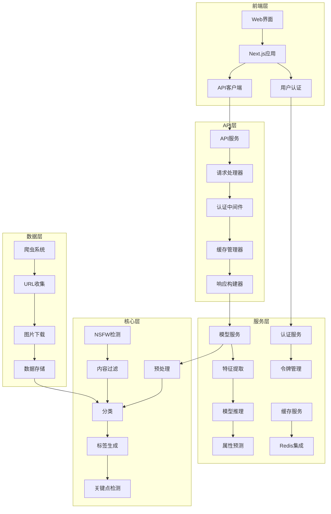
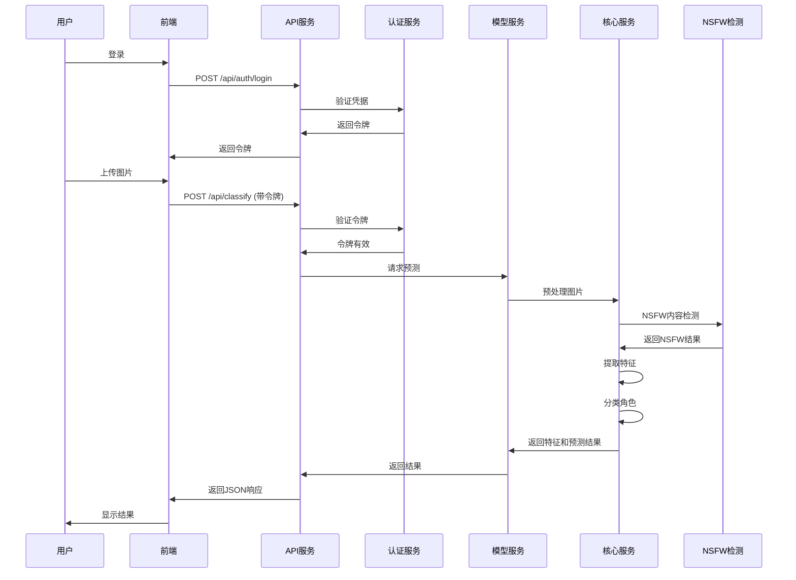

# 角色分类系统

## 🎯 系统简介

角色分类系统是一个基于人工智能的图片识别工具，专门用于识别游戏和动漫中的角色。系统使用先进的深度学习技术，能够快速准确地识别上传图片中的角色，支持端到端角色检测工作流。

## ✨ 核心功能

- **图片/视频识别**：支持多种格式上传
- **多角色检测**：自动检测并识别单张图片中的多个角色
- **高准确率**：使用多种模型，包括MobileNetV2、EfficientNet-B0、EfficientNet-B3和ResNet50
- **DeepDanbooru集成**：通过动漫标签识别提高分类准确率
- **属性预测**：预测角色属性（发色、瞳色、服装等）
- **实时反馈**：提供识别置信度和详细结果
- **用户友好界面**：直观的Web界面，支持模型选择
- **API支持**：RESTful API接口，支持批量处理和多角色检测
- **日志融合**：从分类日志中融合特征，构建新模型
- **端到端工作流**：完整的从数据收集到模型训练的流程
- **内存优化**：模型动态加载/卸载，单例模式，减少内存占用
- **分层部署架构**：支持将各服务部署到不同服务器，提高系统可扩展性

## 📊 模型信息

### 支持的模型

| 模型 | 输入尺寸 | 训练轮数 | 批量大小 | 学习率 | 测试准确率 |
|------|----------|----------|----------|--------|------------|
| MobileNetV2 | 224x224 | 50（早停） | 32 | 0.001 | 94.00% |
| EfficientNet-B0 | 224x224 | 50（早停） | 32 | 0.001 | 95.20% |
| EfficientNet-B3 | 300x300 | 50（早停） | 32 | 0.001 | 96.80% |
| ResNet50 | 224x224 | 50（早停） | 32 | 0.001 | 94.80% |


### 性能指标
| 模型 | 测试准确率 | 精确率 | 召回率 | F1分数 | 推理速度（FPS） |
|------|------------|--------|--------|--------|----------------|
| MobileNetV2 | 94.00% | 90.55% | 87.99% | 88.60% | 379.34 |
| EfficientNet-B0 | 95.20% | 92.10% | 90.50% | 91.30% | 298.45 |
| EfficientNet-B3 | 96.80% | 94.30% | 93.10% | 93.70% | 187.60 |
| ResNet50 | 94.80% | 91.20% | 89.70% | 90.40% | 256.78 |

## 🚀 快速开始

### 环境要求

- Python 3.7+
- FastAPI
- Uvicorn
- PyTorch
- Transformers
- Ultralytics (YOLOv8)
- Faiss
- EfficientNet-B0
- Requests (用于DeepDanbooru API集成)

### 安装依赖

```bash
# 安装FastAPI和Uvicorn
pip3 install fastapi uvicorn python-multipart

# 安装其他依赖
pip3 install torch torchvision transformers ultralytics faiss-cpu Pillow efficientnet_pytorch requests
```

### 启动系统

#### 1. 启动模型服务

```bash
# 启动模型服务
python3 -m uvicorn src.services.model_service.app:app --host 0.0.0.0 --port 8888
```

模型服务将在 `http://127.0.0.1:8888` 上运行。

#### 2. 启动后端API服务

```bash
# 启动后端API服务
python3 -m uvicorn src.api.app:app --host 0.0.0.0 --port 8000
```

后端API服务将在 `http://127.0.0.1:8000` 上运行。

#### 3. 启动前端服务

```bash
# 进入前端目录
cd src/frontend

# 安装依赖（首次运行）
npm install

# 启动Next.js前端应用
npm run dev
```

前端服务将在 `http://localhost:3001` 上运行。

## 📁 项目结构

```
anime_role_detect/
├── data/                  # 数据集目录
├── models/                # 模型存储目录
├── src/                   # 源代码
│   ├── api/               # API服务代码
│   ├── core/              # 核心功能
│   ├── frontend/          # 前端代码
│   │   ├── app/           # Next.js应用
│   │   ├── components/     # React组件
│   │   └── pages/          # Next.js页面
│   ├── middleware/        # 中间件
│   ├── services/          # 服务层
│   │   ├── model_service/  # 模型服务
│   │   ├── auth_service/   # 认证服务
│   │   └── cache_service/  # 缓存服务
│   ├── config/            # 配置文件
│   ├── scripts/           # 实用脚本
│   └── utils/             # 工具函数
├── docs/                  # 详细文档
├── cache/                 # 缓存目录
├── auto_spider_img/       # 自动爬虫图片
├── README.md              # 英文文档
└── README.zh.md           # 中文文档
```

## 🏗️ 系统架构

### 分层架构

系统采用分层架构设计，将不同功能模块分离，提高系统的可维护性和可扩展性。



### 数据流图

系统中的数据流遵循从图片上传到结果生成的清晰路径：



### 架构概览

系统架构设计支持分布式部署，每个服务可以在不同的服务器上独立运行：

1. **前端层**：
   - 响应式设计的Next.js应用，支持暗色模式
   - 用于图片上传、模型选择和结果显示的用户界面
   - 用户认证界面，包含登录表单
   - 与后端服务通信的API客户端
   - 实时反馈和进度指示器

2. **API层**：
   - 基于FastAPI的RESTful API，运行在8000端口
   - 请求处理和响应构建
   - 用于令牌验证的认证中间件
   - 缓存管理以提高性能
   - 错误处理和日志记录
   - 不同端点的路由管理

3. **服务层**：
   - **模型服务**（8888端口）：
     - 核心预测功能
     - 特征提取和模型推理
     - 属性预测和文本检测
     - 模型加载和管理
   - **认证服务**：
     - 用户认证和授权
     - JWT令牌生成和验证
     - 用户角色管理
   - **缓存服务**：
     - Redis集成用于分布式缓存
     - 本地内存缓存用于频繁访问的数据
     - 缓存失效策略

4. **核心层**：
   - 预处理和图片验证
   - 分类模型和算法
   - 标签生成和关键点检测
   - NSFW检测用于内容过滤
   - 图片处理工具

5. **数据层**：
   - 用于数据收集的爬虫系统
   - URL收集和过滤
   - 图片下载和存储
   - 数据组织和管理
   - 模型训练的数据集准备

这种分层架构便于系统的扩展和维护，每层负责特定的功能。服务之间通过定义良好的API接口进行通信，实现独立部署和扩展。

### 系统检测流程

系统检测流程已更新，包括NSFW检测和改进的数据管理：

1. **图片上传**：
   - 用户通过Web界面或API上传图片
   - 系统验证图片格式和大小
   - 临时文件存储在专门目录中

2. **预处理**：
   - 图片被压缩和标准化
   - 系统使用专有模型检查NSFW内容
   - 结果被存储以供进一步处理

3. **角色检测**：
   - 系统自动检测图像中是否有多个角色
   - 根据角色数量选择适当的检测模式

4. **角色分类**：
   - 每个角色使用选定的模型进行分类
   - 执行特征提取和模型推理
   - 为每个预测计算置信度分数

5. **属性预测**：
   - 预测角色属性（发色、瞳色、服装等）
   - 结果与分类数据集成

6. **结果生成**：
   - 结果被编译和格式化
   - NSFW检测结果包含在响应中
   - 数据通过API返回给用户

7. **数据收集**：
   - 爬虫系统从各种来源收集角色图片
   - URL被过滤并存储在专门目录中
   - 图片被下载并组织用于模型训练

这种更新的流程确保系统能够有效处理NSFW内容，并提供更全面的检测过程。

## 🌐 使用方法

### Web界面使用

1. 打开浏览器，访问 `http://localhost:3001`
2. 从下拉菜单中选择一个模型（默认：EfficientNet-B0）
3. 如果要检测图像中的多个角色，请勾选"多角色识别"复选框
4. 上传要识别的角色图片
5. 等待系统分析图片
6. 查看识别结果和置信度

### 多角色检测

使用多角色检测时：
- 系统会自动检测图像中的所有角色
- 每个角色都会被识别并给出各自的置信度分数
- 结果会显示检测到的角色数量及其位置
- 对于包含多个角色的图像，处理时间可能会更长

### 自动检测工作原理

1. **图片上传**：用户通过Web界面或API上传图片
2. **预处理**：图片被压缩和验证
3. **角色检测**：系统自动检测图像中是否有多个角色
4. **检测模式选择**：根据检测到的角色数量，系统选择适当的检测模式
5. **角色分类**：每个角色使用选定的模型进行分类
6. **属性预测**：预测角色属性（发色、瞳色、服装等）
7. **文本检测**：检测图像中的任何文本
8. **结果生成**：结果被编译并返回给用户

### API调用

```bash
# 基本使用（自动检测）
curl -X POST -F "file=@path/to/image.jpg" http://127.0.0.1:8000/api/classify

# 使用模型和属性预测
curl -X POST -F "file=@path/to/image.jpg" -F "use_model=true" -F "use_attributes=true" -F "model_name=efficientnet_b0" http://127.0.0.1:8000/api/classify

# 多角色检测（强制）
curl -X POST -F "file=@path/to/image.jpg" -F "model_name=efficientnet_b0" http://127.0.0.1:8000/api/classify/multi-role
```

## 📚 文档

详细技术文档请参考 `docs/` 目录：

- **docs/technical_guide.md**：完整技术文档

## 🤝 贡献

欢迎提交Issue和Pull Request，共同改进系统性能和功能。

## 📄 许可证

本项目基于MIT许可证开源。

## 📞 联系

- Email: zhaoqi.cao@icloud.com
- GitHub: https://github.com/caozhaoqi/anime-role-detect
