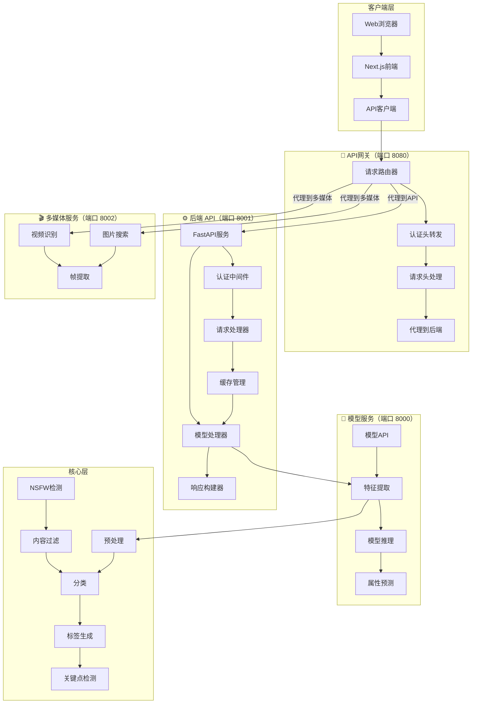
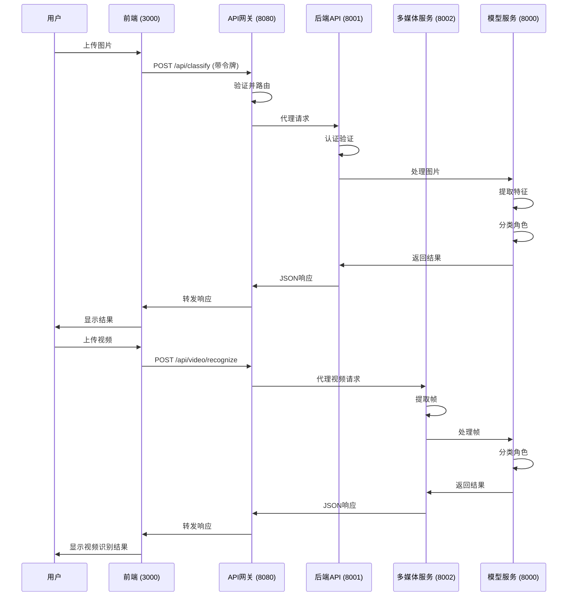

# 角色分类系统

## 🎯 系统简介

角色分类系统是一个基于人工智能的图片识别工具，专门用于识别游戏和动漫中的角色。系统使用先进的深度学习技术，能够快速准确地识别上传图片中的角色，支持端到端角色检测工作流。

## ✨ 核心功能

- **图片/视频识别**：支持多种格式上传
- **多角色检测**：自动检测并识别单张图片中的多个角色
- **高准确率**：使用多种模型，包括MobileNetV2、EfficientNet-B0、EfficientNet-B3和ResNet50
- **DeepDanbooru集成**：通过动漫标签识别提高分类准确率
- **属性预测**：预测角色属性（发色、瞳色、服装等）
- **实时反馈**：提供识别置信度和详细结果
- **用户友好界面**：直观的Web界面，支持模型选择
- **API支持**：RESTful API接口，支持批量处理和多角色检测
- **日志融合**：从分类日志中融合特征，构建新模型
- **端到端工作流**：完整的从数据收集到模型训练的流程
- **内存优化**：模型动态加载/卸载，单例模式，减少内存占用
- **分层部署架构**：支持将各服务部署到不同服务器，提高系统可扩展性
- **API网关**：统一的API请求入口，支持代理路由

## 📊 模型信息

### 支持的模型

| 模型 | 输入尺寸 | 训练轮数 | 批量大小 | 学习率 | 测试准确率 |
|------|----------|----------|---------|--------|------------|
| MobileNetV2 | 224x224 | 50（早停） | 32 | 0.001 | 94.00% |
| EfficientNet-B0 | 224x224 | 50（早停） | 32 | 0.001 | 95.20% |
| EfficientNet-B3 | 300x300 | 50（早停） | 32 | 0.001 | 96.80% |
| ResNet50 | 224x224 | 50（早停） | 32 | 0.001 | 94.80% |


### 性能指标
| 模型 | 测试准确率 | 精确率 | 召回率 | F1分数 | 推理速度（FPS） |
|------|------------|--------|--------|--------|----------------|
| MobileNetV2 | 94.00% | 90.55% | 87.99% | 88.60% | 379.34 |
| EfficientNet-B0 | 95.20% | 92.10% | 90.50% | 91.30% | 298.45 |
| EfficientNet-B3 | 96.80% | 94.30% | 93.10% | 93.70% | 187.60 |
| ResNet50 | 94.80% | 91.20% | 89.70% | 90.40% | 256.78 |

## 🚀 快速开始

### 环境要求

- Python 3.9+
- FastAPI
- Uvicorn
- PyTorch
- Transformers
- Ultralytics (YOLOv8)
- Faiss
- EfficientNet-Python
- Requests (用于DeepDanbooru API集成)
- Node.js 16+ (用于前端)

### 安装依赖

```bash
pip3 install fastapi uvicorn python-multipart httpx
pip3 install torch torchvision transformers ultralytics faiss-cpu Pillow efficientnet_pytorch requests
```

### 启动系统

#### 1. 启动核心服务（推荐）

```bash
python3 src/application.py start --core
```

这将启动所有核心服务：
- **多媒体服务**: `http://127.0.0.1:8002`
- **API 服务**: `http://127.0.0.1:8001`

#### 2. 启动 API 网关（主入口）

```bash
python3 src/application.py start --services gateway
```

API 网关将在 `http://127.0.0.1:8080` 上运行。**所有 API 请求必须通过此网关。**

#### 3. 启动前端服务

```bash
cd src/frontend
npm install
npm run dev
```

前端服务将在 `http://localhost:3000` 上运行。

## 📁 项目结构

```
anime_role_detect/
├── data/                      # 数据集目录
├── models/                    # 模型存储目录
├── src/                       # 源代码
│   ├── api/                   # 后端 API 服务（端口 8001）
│   ├── core/                  # 核心功能
│   ├── frontend/              # 前端代码（Next.js）
│   │   └── app/               # API 路由和组件
│   ├── middleware/            # 中间件
│   ├── services/              # 服务层
│   │   ├── api_gateway/       # API 网关服务（端口 8080）
│   │   ├── multimedia/        # 多媒体服务（端口 8002）
│   │   │   ├── image_search/  # 图片搜索功能
│   │   │   └── video_recognize/ # 视频识别功能
│   │   ├── model_service/     # 模型服务（端口 8000）
│   │   ├── auth_service/      # 认证服务
│   │   ├── cache_service/     # 缓存服务
│   │   └── processor/         # 图片/文本处理
│   ├── config/                # 配置文件
│   ├── scripts/               # 实用脚本
│   └── utils/                 # 工具函数
```

## 🏗️ 系统架构

### 分层架构

系统采用分层架构设计，以 API 网关为统一入口：



### 服务通信流程



### 架构概览

系统架构设计支持分布式部署，**以 API 网关为统一入口**：

1. **客户端层**：
   - 响应式设计的 Next.js 应用，支持暗色模式
   - 用于图片/视频上传、模型选择和结果显示的用户界面
   - 用户认证界面，包含登录表单
   - 通过网关与后端服务通信的 API 客户端

2. **网关层（端口 8080）**：
   - **API 网关** - **所有 API 请求的统一入口**
   - 根据路径前缀进行请求路由：
     - `/api/search/*` → 多媒体服务 (8002)
     - `/api/video/*` → 多媒体服务 (8002)
     - `/api/classify/*` → 后端 API (8001)
     - `/api/model/*` → 模型服务 (8000)
     - 其他请求 → 后端 API (8001)
   - 认证头转发
   - 请求头处理（content-type、content-length 管理）
   - 使用 `trust_env=False` 绕过系统代理，实现本地通信

3. **后端层（端口 8001）**：
   - 基于 FastAPI 的 RESTful API
   - 请求处理和响应构建
   - 用于令牌验证的认证中间件
   - 缓存管理以提高性能
   - 业务逻辑和模型协调

4. **多媒体层（端口 8002）**：
   - 使用 FAISS 的图片搜索功能
   - 视频识别与帧提取
   - 多媒体处理和分析
   - 与模型服务集成进行角色分类

5. **模型层（端口 8000）**：
   - 核心预测功能
   - 特征提取和模型推理
   - 属性预测和文本检测
   - 模型加载和管理
   - 多模型支持（EfficientNet、ResNet、MobileNet）

6. **核心层**：
   - 预处理和图片验证
   - 分类模型和算法
   - 标签生成和关键点检测
   - NSFW 检测用于内容过滤
   - DeepDanbooru 集成用于动漫标签识别

### 系统检测流程

1. **图片上传**：用户通过 Web 界面上传图片
2. **预处理**：图片被压缩和验证
3. **角色检测**：系统检测图像中是否有多个角色
4. **角色分类**：每个角色使用选定的模型进行分类
5. **属性预测**：预测角色属性
6. **结果生成**：结果被编译并返回

## 🌐 使用方法

### Web 界面使用

1. 打开浏览器，访问 `http://localhost:3000`
2. 使用凭据登录
3. 从下拉菜单中选择一个模型
4. 选择功能标签：角色识别、图片搜索或视频识别
5. 如需多角色检测，请勾选相应选项
6. 上传要识别的角色图片/视频
7. 等待系统分析
8. 查看识别结果和置信度

### API 接口

**所有 API 请求必须发送到 API 网关（端口 8080）**：

| 接口 | 方法 | 描述 | 认证 |
|------|------|------|------|
| `/` | GET | 根信息 | 否 |
| `/api/health` | GET | 网关健康检查 | 否 |
| `/api/services` | GET | 服务状态 | 否 |
| `/api/auth/login` | POST | 用户登录 | 否 |
| `/api/classify` | POST | 图片分类 | 是 |
| `/api/classify/multi-role` | POST | 多角色检测 | 是 |
| `/api/search/image` | POST | 图片搜索 | 是 |
| `/api/video/recognize` | POST | 视频识别 | 是 |
| `/api/history` | GET | 识别历史 | 是 |
| `/api/models` | GET | 可用模型 | 是 |

### API 调用示例

```bash
# 健康检查
curl http://127.0.0.1:8080/api/health

# 服务状态
curl http://127.0.0.1:8080/api/services

# 登录
curl -X POST -F "username=admin" -F "password=admin123" http://127.0.0.1:8080/api/auth/login

# 图片分类（带令牌）
curl -X POST -F "file=@path/to/image.jpg" \
     -F "model_name=efficientnet_b0_loli_reorganized" \
     -F "use_model=true" \
     -F "use_attributes=true" \
     -H "Authorization: Bearer YOUR_TOKEN" \
     http://127.0.0.1:8080/api/classify

# 多角色检测
curl -X POST -F "file=@path/to/image.jpg" \
     -F "model_name=efficientnet_b0_loli_reorganized" \
     -H "Authorization: Bearer YOUR_TOKEN" \
     http://127.0.0.1:8080/api/classify/multi-role

# 图片搜索
curl -X POST -F "file=@path/to/image.jpg" \
     -H "Authorization: Bearer YOUR_TOKEN" \
     http://127.0.0.1:8080/api/search/image

# 视频识别
curl -X POST -F "file=@path/to/video.mp4" \
     -F "frame_interval=1" \
     -F "confidence_threshold=0.5" \
     -H "Authorization: Bearer YOUR_TOKEN" \
     http://127.0.0.1:8080/api/video/recognize
```

## 🔧 配置

### 服务端口

| 服务 | 默认端口 | 环境变量 |
|------|----------|----------|
| API 网关 | 8080 | - |
| 后端 API | 8001 | `BACKEND_PORT` |
| 多媒体服务 | 8002 | - |
| 模型服务 | 8000 | `MODEL_SERVICE_PORT` |
| 前端 | 3000 | `FRONTEND_PORT` |

### 重要说明

- **API 网关（端口 8080）**必须在其他服务之前启动，以确保正确的路由
- **所有前端请求必须通过 API 网关**，不能直接访问后端服务
- 网关使用 `trust_env=False` 来绕过系统代理，实现本地通信
- 临时目录（`temp/`）必须存在才能进行图片/视频处理
- 所有后端服务可以运行在不同的服务器上，只需正确配置网关

## 📚 文档

详细技术文档请参考 `docs/` 目录：

- **docs/technical_guide.md**：完整技术文档
- **docs/architecture/**：架构文档

## 🤝 贡献

欢迎提交 Issue 和 Pull Request，共同改进系统性能和功能。

## 📄 许可证

本项目基于 MIT 许可证开源。

## 📞 联系

- Email: zhaoqi.cao@icloud.com
- GitHub: https://github.com/caozhaoqi/anime-role-detect