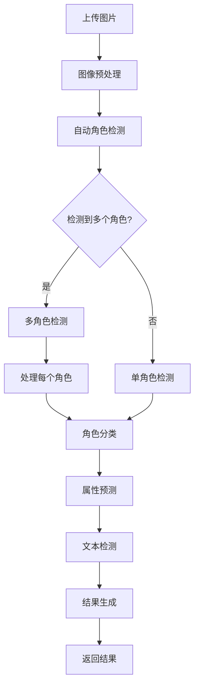

# 角色分类系统

## 🎯 系统简介

角色分类系统是一个基于人工智能的图片识别工具，专门用于识别游戏和动漫中的角色。系统使用先进的深度学习技术，能够快速准确地识别上传图片中的角色，支持端到端角色检测工作流。

## ✨ 核心功能

- **图片/视频识别**：支持多种格式上传
- **多角色检测**：自动检测并识别单张图片中的多个角色
- **高准确率**：使用多种模型，包括MobileNetV2、EfficientNet-B0、EfficientNet-B3和ResNet50
- **DeepDanbooru集成**：通过动漫标签识别提高分类准确率
- **属性预测**：预测角色属性（发色、瞳色、服装等）
- **实时反馈**：提供识别置信度和详细结果
- **用户友好界面**：直观的Web界面，支持模型选择
- **API支持**：RESTful API接口，支持批量处理和多角色检测
- **日志融合**：从分类日志中融合特征，构建新模型
- **端到端工作流**：完整的从数据收集到模型训练的流程

## 📊 模型信息

### 支持的模型

| 模型 | 输入尺寸 | 训练轮数 | 批量大小 | 学习率 | 测试准确率 |
|------|----------|----------|----------|--------|------------|
| MobileNetV2 | 224x224 | 50（早停） | 32 | 0.001 | 94.00% |
| EfficientNet-B0 | 224x224 | 50（早停） | 32 | 0.001 | 95.20% |
| EfficientNet-B3 | 300x300 | 50（早停） | 32 | 0.001 | 96.80% |
| ResNet50 | 224x224 | 50（早停） | 32 | 0.001 | 94.80% |

### 训练数据
- **总样本数**：2,629张图像
- **类别数**：11个角色
- **训练集**：2,103张图像
- **验证集**：526张图像

### 支持的角色
| 角色 | 样本数 | 测试精确率 | 测试召回率 |
|------|--------|------------|------------|
| 阿罗娜 | 398 | 96.18% | 99.60% |
| 日奈 | 55 | 86.44% | 92.73% |
| 普拉娜 | 486 | 97.50% | 82.98% |
| 千夏 | 25 | 89.47% | 68.00% |
| 亚子 | 28 | 89.29% | 89.29% |
| 枫香 | 6 | 100.00% | 83.33% |
| 伊织 | 3 | 75.00% | 100.00% |
| 可莉 | 226 | - | - |
| 提宝 | 283 | - | - |
| 火花 | 412 | - | - |
| 纳西妲 | 707 | - | - |

### 性能指标
| 模型 | 测试准确率 | 精确率 | 召回率 | F1分数 | 推理速度（FPS） |
|------|------------|--------|--------|--------|----------------|
| MobileNetV2 | 94.00% | 90.55% | 87.99% | 88.60% | 379.34 |
| EfficientNet-B0 | 95.20% | 92.10% | 90.50% | 91.30% | 298.45 |
| EfficientNet-B3 | 96.80% | 94.30% | 93.10% | 93.70% | 187.60 |
| ResNet50 | 94.80% | 91.20% | 89.70% | 90.40% | 256.78 |

## 🚀 快速开始

### 环境要求

- Python 3.7+
- Flask
- PyTorch
- Transformers
- Ultralytics (YOLOv8)
- Faiss
- EfficientNet-B0
- Requests (用于DeepDanbooru API集成)

### 安装依赖

```bash
# 安装Flask
pip3 install flask

# 安装其他依赖
pip3 install torch torchvision transformers ultralytics faiss-cpu Pillow efficientnet_pytorch requests
```

### 启动系统

#### 1. 启动后端服务

```bash
# 启动后端应用
python3 src/backend/api/app.py
```

后端服务将在 `http://127.0.0.1:8000` 上运行。

#### 2. 启动前端服务

```bash
# 进入前端目录
cd frontend

# 安装依赖（首次运行）
npm install

# 启动Next.js前端应用
npm run dev
```

前端服务将在 `http://localhost:3000` 上运行。

## 📁 项目结构

```
anime_role_detect/
├── data/                  # 数据集目录
├── models/                # 模型存储目录
├── src/                   # 源代码
│   ├── backend/           # 后端代码
│   ├── core/              # 核心功能
│   ├── data/              # 数据相关代码
│   ├── frontend/          # 前端代码
│   ├── models/            # 模型相关代码
│   ├── config/            # 配置文件
│   ├── scripts/           # 实用脚本
│   └── utils/             # 工具函数
├── docs/                  # 详细文档
├── cache/                 # 缓存目录
├── auto_spider_img/       # 自动爬虫图片
├── README.md              # 英文文档
└── README.zh.md           # 中文文档
```

## 🌐 使用方法

### Web界面使用

1. 打开浏览器，访问 `http://localhost:3000`
2. 从下拉菜单中选择一个模型（默认：EfficientNet-B0）
3. 如果要检测图像中的多个角色，请勾选"多角色识别"复选框
4. 上传要识别的角色图片
5. 等待系统分析图片
6. 查看识别结果和置信度

### 多角色检测

使用多角色检测时：
- 系统会自动检测图像中的所有角色
- 每个角色都会被识别并给出各自的置信度分数
- 结果会显示检测到的角色数量及其位置
- 对于包含多个角色的图像，处理时间可能会更长

### 自动检测流程

系统可以根据图像内容自动判断使用单角色还是多角色检测。以下是完整流程：



### 自动检测工作原理

1. **图片上传**：用户通过Web界面或API上传图片
2. **预处理**：图片被压缩和验证
3. **角色检测**：系统自动检测图像中是否有多个角色
4. **检测模式选择**：根据检测到的角色数量，系统选择适当的检测模式
5. **角色分类**：每个角色使用选定的模型进行分类
6. **属性预测**：预测角色属性（发色、瞳色、服装等）
7. **文本检测**：检测图像中的任何文本
8. **结果生成**：结果被编译并返回给用户

### API调用

```bash
# 基本使用（自动检测）
curl -X POST -F "file=@path/to/image.jpg" http://127.0.0.1:8000/api/classify

# 使用模型和属性预测
curl -X POST -F "file=@path/to/image.jpg" -F "use_model=true" -F "use_attributes=true" -F "model_name=efficientnet_b0" http://127.0.0.1:8000/api/classify

# 多角色检测（强制）
curl -X POST -F "file=@path/to/image.jpg" -F "model_name=efficientnet_b0" http://127.0.0.1:8000/api/classify/multi-role
```

## � 文档

详细技术文档请参考 `docs/` 目录：

- **docs/technical_guide.md**：完整技术文档

## 🤝 贡献

欢迎提交Issue和Pull Request，共同改进系统性能和功能。

## 📄 许可证

本项目基于MIT许可证开源。

## 📞 联系

- Email: zhaoqi.cao@icloud.com
- GitHub: https://github.com/caozhaoqi/anime-role-detect

## ☸️ Kubernetes部署

### 前提条件

- Kubernetes集群（Minikube、Kind或生产集群）
- Docker
- kubectl

### Docker镜像

#### 后端API

```Dockerfile
# Dockerfile for backend API
FROM python:3.9-slim

WORKDIR /app

COPY requirements.txt .
RUN pip install --no-cache-dir -r requirements.txt

COPY src/backend/ ./backend/
COPY src/core/ ./core/
COPY src/utils/ ./utils/

EXPOSE 8000

CMD ["python", "backend/api/run_api.py"]
```

#### 前端

```Dockerfile
# Dockerfile for frontend
FROM nginx:alpine

COPY src/frontend/ /usr/share/nginx/html

EXPOSE 80

CMD ["nginx", "-g", "daemon off;"]
```

### Kubernetes配置

#### 后端部署

```yaml
# backend-deployment.yaml
apiVersion: apps/v1
kind: Deployment
metadata:
  name: character-classification-backend
  labels:
    app: character-classification
    component: backend
spec:
  replicas: 2
  selector:
    matchLabels:
      app: character-classification
      component: backend
  template:
    metadata:
      labels:
        app: character-classification
        component: backend
    spec:
      containers:
      - name: backend
        image: character-classification-backend:latest
        ports:
        - containerPort: 8000
        resources:
          limits:
            cpu: "2"
            memory: "4Gi"
          requests:
            cpu: "1"
            memory: "2Gi"
```

#### 前端部署

```yaml
# frontend-deployment.yaml
apiVersion: apps/v1
kind: Deployment
metadata:
  name: character-classification-frontend
  labels:
    app: character-classification
    component: frontend
spec:
  replicas: 2
  selector:
    matchLabels:
      app: character-classification
      component: frontend
  template:
    metadata:
      labels:
        app: character-classification
        component: frontend
    spec:
      containers:
      - name: frontend
        image: character-classification-frontend:latest
        ports:
        - containerPort: 80
        resources:
          limits:
            cpu: "1"
            memory: "512Mi"
          requests:
            cpu: "500m"
            memory: "256Mi"
```

#### 服务

```yaml
# services.yaml
apiVersion: v1
kind: Service
metadata:
  name: character-classification-backend
spec:
  selector:
    app: character-classification
    component: backend
  ports:
  - port: 8000
    targetPort: 8000
  type: ClusterIP
---
apiVersion: v1
kind: Service
metadata:
  name: character-classification-frontend
spec:
  selector:
    app: character-classification
    component: frontend
  ports:
  - port: 80
    targetPort: 80
  type: LoadBalancer
```

### 部署步骤

1. **构建Docker镜像**
   ```bash
   # 构建后端镜像
   docker build -t character-classification-backend:latest -f Dockerfile.backend .
   
   # 构建前端镜像
   docker build -t character-classification-frontend:latest -f Dockerfile.frontend .
   ```

2. **推送镜像到注册表**（如果使用远程集群）
   ```bash
   docker tag character-classification-backend:latest <registry>/character-classification-backend:latest
   docker tag character-classification-frontend:latest <registry>/character-classification-frontend:latest
   docker push <registry>/character-classification-backend:latest
   docker push <registry>/character-classification-frontend:latest
   ```

3. **部署到Kubernetes**
   ```bash
   kubectl apply -f backend-deployment.yaml
   kubectl apply -f frontend-deployment.yaml
   kubectl apply -f services.yaml
   ```

4. **验证部署**
   ```bash
   kubectl get pods
   kubectl get services
   ```

5. **访问应用**
   - 前端：使用LoadBalancer IP或主机名
   - 后端API：使用ClusterIP或端口转发

### 监控

要在Kubernetes中监控应用，可以集成Prometheus和Grafana：

1. **安装Prometheus和Grafana**
   ```bash
   helm repo add prometheus-community https://prometheus-community.github.io/helm-charts
   helm install prometheus prometheus-community/kube-prometheus-stack
   ```

2. **配置自定义指标**
   - 向部署添加Prometheus注释
   - 在Grafana中创建自定义仪表板

### 自动缩放

要根据流量自动缩放应用：

1. **水平Pod自动缩放器**
   ```yaml
   apiVersion: autoscaling/v2
   kind: HorizontalPodAutoscaler
   metadata:
     name: character-classification-backend-hpa
   spec:
     scaleTargetRef:
       apiVersion: apps/v1
       kind: Deployment
       name: character-classification-backend
     minReplicas: 2
     maxReplicas: 10
     metrics:
     - type: Resource
       resource:
         name: cpu
         target:
           type: Utilization
           averageUtilization: 70
   ```

2. **应用HPA**
   ```bash
   kubectl apply -f hpa.yaml
   ```

---

**© 2026 角色分类系统** - 让角色识别变得简单！
