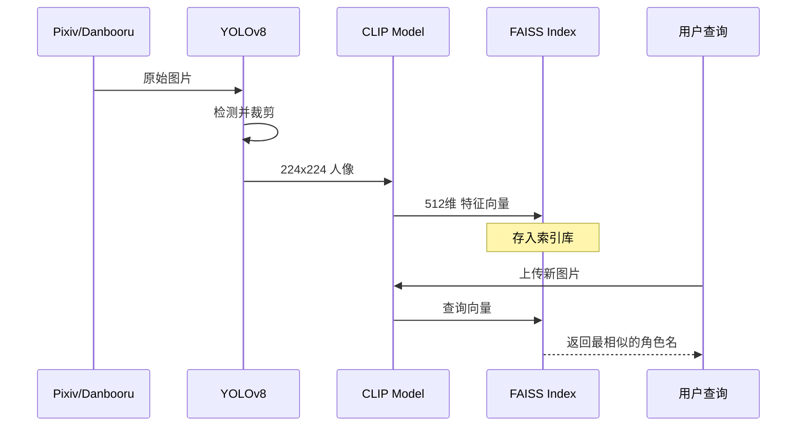

# 【深度解析】二次元角色 AI 系统的硬核架构设计

*(图：系统整体架构概览)*

在上一篇博客中，我们介绍了如何训练模型。今天，我们深入代码底层，扒一扒 `anime_role_detect` 这个项目背后的技术架构和设计哲学。

如果你对 **CLIP**、**FAISS**、**GAN** 这些技术名词感兴趣，或者想知道一个工业级的 AI 项目是如何组织的，那这篇绝对不容错过。

---

## 1. 总体架构：三驾马车

整个系统由三个核心子系统驱动，分工明确：

1.  **数据流水线**: 负责把网上的生图变成模型能吃的熟肉。
2.  **识别引擎**: 负责“认人”，用的是目前最先进的向量检索技术。
3.  **生成引擎**: 负责“造人”，基于检测模型指导的生成对抗网络。

---

## 2. 核心模块大揭秘

### 2.1 数据采集：智能爬虫的自我修养

*(图：多源数据采集策略示意图)*

*   **多源策略**: 我们不把鸡蛋放在一个篮子里。首选 **Pixiv API**（带 Token 认证，稳！），不行就切 **Danbooru**，再不行就切 **Konachan**。
*   **智能清洗**: 自动过滤 R-18 内容。毕竟我们要训练的是正经 AI（手动狗头）。
*   **自动归档**: 爬下来的图自动按角色名分文件夹存好，强迫症福音。

### 2.2 预处理：YOLOv8 的精准打击

图片下好了，不能直接喂给模型。我们请出了 **YOLOv8**：

*(图：YOLOv8 检测 -> 筛选置信度最高 -> 智能裁剪)*

1.  **检测**: 先找出图里的人在哪。
2.  **筛选**: 置信度低的不要，只要最自信的那一个。
3.  **裁剪**: 把人抠出来，缩放到 224x224。
这一步保证了后续模型看到的都是满满的干货，没有背景干扰。

### 2.3 识别引擎：CLIP + FAISS 的降维打击

这是本项目的杀手锏。我们没有用传统的 ResNet 做分类，而是用了 **CLIP**。

*(图：CLIP 提取的语义特征 vs 传统 CNN 特征)*

*   **为什么选 CLIP?** CLIP 看了 4 亿对图文，它懂什么是“双马尾”，什么是“傲娇脸”。它提取的特征向量，语义丰富度完爆传统 CNN。
*   **为什么用 FAISS?** 当你有 100 个老婆时，挨个比对还行；当你有 100 万个老婆时，暴力比对就是灾难。FAISS 让我们能在毫秒级内从海量向量中找到最像的那一个。

### 2.4 生成引擎：消除伪影的艺术

在生成部分，我们做了一个关键的技术改进：**消除棋盘格伪影**。

*(图：Upsample + Conv2d 结构示意图)*

*   传统的 GAN 喜欢用 `ConvTranspose2d` 做上采样，结果生成的图总有一层淡淡的网格，很难看。
*   我们改用了 **`Upsample(bilinear)` + `Conv2d`**。虽然计算量稍微大了一丢丢，但生成的图片质感提升了不止一个档次，平滑细腻。

---

## 3. 数据流向：从网页到模型

想象一张图片在系统里的奇幻漂流：

1.  **爬虫**把它从 Pixiv 抓回来。
2.  **YOLO** 把它裁剪成标准大头照。
3.  **CLIP** 把它变成一串 512 维的数字（向量）。
4.  **FAISS** 把这串数字存进索引库。
5.  当新图片来时，系统算出新向量，去 FAISS 库里一搜：“嘿，这串数字跟库里的‘雷姆’最像！” —— **识别完成**。

---

## 4. 写在最后

这个架构的设计初衷就是 **模块化** 和 **可扩展性**。
*   想换个更强的特征提取器？改 `feature_extraction` 模块就行。
*   想支持更多角色？往 FAISS 里 `add` 向量就行，不用重训模型。

这就是现代 AI 系统设计的魅力。希望这篇架构解析能给你带来一些灵感！
