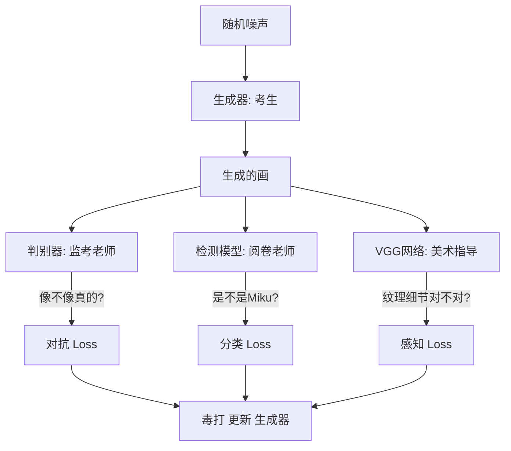

# 【实战】手把手教你训练二次元角色“识别+生成”全家桶


*(图：项目运行效果概览 - 左边是识别出的雷姆，右边是生成的雷姆)*

大家好！今天为大家带来一套硬核的二次元角色 AI 系统训练指南。无论你是想做一个能叫出所有“老婆”名字的识别器，还是想亲手“画”出心仪角色的生成器，这篇文章都能帮到你。

我们把整个系统分成了两个核心部分：**慧眼识人的“检测模型”** 和 **神笔马良的“生成模型”**。

---

## 第一部分：慧眼识人 —— 训练你的角色检测模型

检测模型是整个系统的基石。它的任务很简单：给它一张图，它告诉你这是谁。

### 1. 准备工作
首先，你需要把收集到的老婆们（图片）按名字分好文件夹，放在 `data/all_characters/` 下。


*(图：建议的文件目录结构，每个角色一个文件夹，名字即标签)*

比如 `data/all_characters/初音未来/` 里全是 Miku 的美图。

### 2. 核心技术栈
我们没有从零开始造轮子，而是站在了巨人的肩膀上：

*   **骨架 (Backbone)**: 选用 **EfficientNet-B0**。这货参数少、跑得快，但在二次元分类任务上准得离谱。
*   **大脑 (Head)**: 修改了最后的全连接层，让它输出的类别数等于你文件夹的数量。
*   **策略**: 使用 **交叉熵损失** 配合 **AdamW 优化器**，再加个 **余弦退火** 调整学习率，稳！

### 3. 一键开跑
准备好数据后，一行命令启动训练：
```bash
python3 src/scripts/classification_script/classification_script.py
```


*(图：看着 Loss 一路下降，Accuracy 一路上升，是炼丹师最快乐的时刻)*

等进度条跑完，你就拥有了一个能识别各路二次元角色的 AI 了！

---

## 第二部分：神笔马良 —— 基于检测指导的图像生成

这部分比较好玩。我们不满足于仅仅“认出”角色，我们还要“创造”角色。

### 1. 它是怎么工作的？
这是一个 **“多方博弈”** 的过程，就像画画考试。我们来看下面这张架构图：



*   **生成器 (Generator)**: 负责画画的考生。
*   **判别器 (Discriminator)**: 负责找茬的监考老师，专门看画得像不像真的二次元图。
*   **检测模型 (Detection Model)**: 负责打分的阅卷老师，专门看画得像不像指定的角色（比如是不是 Miku）。
*   **VGG网络**: 负责抠细节的美术指导，对比纹理和线条。

### 2. 独家秘方（Loss 设计）
为了让生成的图既保真又像目标角色，我们设计了三重 Loss：

1.  **对抗 Loss (0.1)**: 保证是张图，不是乱码。
2.  **分类 Loss (0.2)**: 保证是 Miku，不是别人。
3.  **感知 Loss (10.0)**: **重点！** 我们给了它超高的权重，强迫生成器去学习真实的纹理细节，拒绝模糊！

### 3. 避坑指南


*(图：左边是使用 ConvTranspose2d 产生的网格伪影，右边是使用 Upsample 后的平滑效果)*

*   **生成的图有网格？** 别用 `ConvTranspose2d`，我们换成了 `Upsample + Conv2d`，丝般顺滑。
*   **生成的图不像？** 检查一下你的检测模型是不是太弱了，或者感知 Loss 权重不够。

### 4. 启动生成训练
```bash
# 训练第 0 号角色，跑 3000 轮
python3 scripts/generate_from_detection.py --target_class 0 --num_epochs 3000
```


*(图：随着 Epoch 增加，从一团噪声逐渐变成清晰的角色)*

---

## 总结

*   **检测模型** = **识别**（这是谁？）
*   **生成模型** = **创造**（画个谁！）

左手识别，右手生成，这套二次元 AI 全家桶，你值得拥有！快去试试吧！
