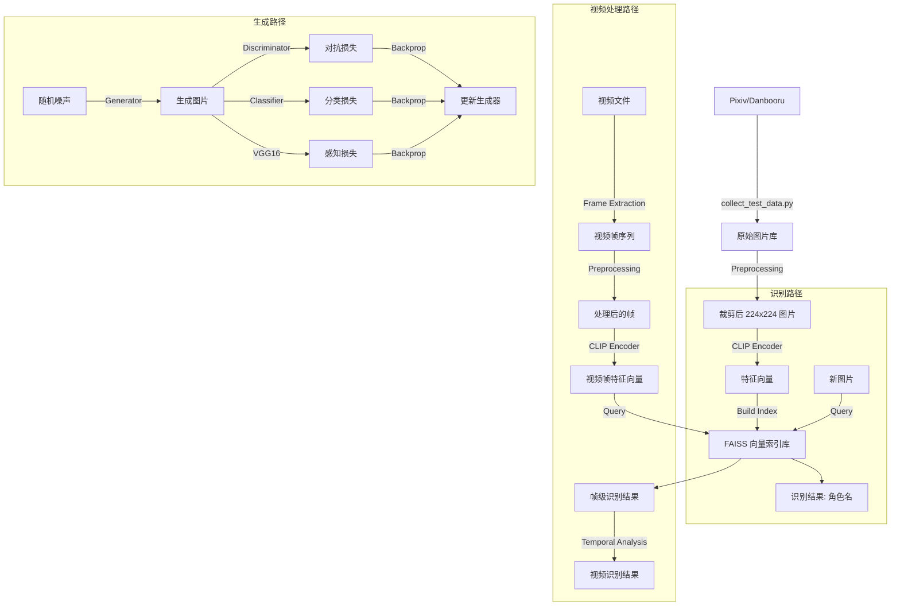

# 二次元角色识别与生成系统 - 技术架构文档

本文档详细描述了 `anime_role_detect` 项目的底层实现细节、架构设计决策以及核心模块的工作原理。

---

## 1. 系统总体架构

本项目采用模块化设计，主要包含五个核心子系统：
1.  **数据采集与预处理流水线**：负责数据的获取、清洗和标准化。
2.  **识别与检索子系统**：基于深度学习特征提取和向量检索技术。
3.  **生成子系统**：基于检测模型指导的生成对抗网络。
4.  **在线学习子系统**：支持模型的持续更新和新角色添加。
5.  **多模态融合子系统**：结合图像和文本信息提升识别准确性。

### 1.1 目录结构映射

*   `src/core/preprocessing`: 图像/视频预处理（YOLOv8 检测与裁剪）。
*   `src/core/feature_extraction`: 特征提取（CLIP / EfficientNet）。
*   `src/core/classification`: 向量检索与分类（FAISS）。
*   `scripts/generate_from_detection.py`: 图像生成模型训练与推理。
*   `tests/collect_test_data.py`: 多源数据采集爬虫。
*   `scripts/data_augmentation/automated_data_expansion.py`: 自动化数据集扩充。
*   `scripts/model_training/train_model_distillation.py`: 模型蒸馏训练。
*   `scripts/model_training/online_learning_system.py`: 在线学习系统。
*   `scripts/model_training/multimodal_fusion.py`: 多模态融合系统。
*   `scripts/evaluation/comprehensive_evaluation.py`: 综合评估框架。

---

## 2. 核心模块实现细节

### 2.1 数据采集 (Data Collection)
*   **实现文件**: `tests/collect_test_data.py`
*   **核心逻辑**:
    *   **多源策略**: 优先使用 **Pixiv API** (通过 `pixivpy3` 和 `refresh_token` 认证)，若失败则自动降级至 **Danbooru** 或 **Konachan**，最后回退到本地样本生成。
    *   **抗反爬**: 实现了随机延时 (`sleep`) 和 User-Agent 伪装。
    *   **数据清洗**: 自动过滤 R-18 内容（通过 API 字段判断），确保数据集的安全性。
    *   **存储结构**: 自动按 `data/all_characters/{角色名}` 结构归档，便于后续 `DataLoader` 读取。

### 2.2 图像预处理 (Preprocessing)
*   **实现文件**: `src/core/preprocessing/preprocessing.py`
*   **技术栈**: `Ultralytics YOLOv8`
*   **工作流程**:
    1.  **加载模型**: 默认加载 `yolov8s-anime.pt`（针对二次元优化的权重）。
    2.  **目标检测**: 输入原始图像，检测 `person` (class 0) 类别。
    3.  **主体筛选**: 过滤置信度低于 0.5 的目标，选择置信度最高的边界框（Bounding Box）。
    4.  **智能裁剪**: 根据边界框裁剪图像，并进行 Padding（保持长宽比）或 Resize 到 `224x224`。
    5.  **归一化**: 转换为 RGB 格式，像素值归一化到 `[0, 1]` 或 `[-1, 1]` (取决于后续模型需求)。

### 2.3 特征提取与分类 (Feature Extraction & Classification)
*   **实现文件**: 
    *   `src/core/feature_extraction/feature_extraction.py`
    *   `src/core/classification/classification.py`
*   **特征提取**:
    *   使用 **CLIP (ViT-B/32)** 模型。CLIP 在图文匹配任务上预训练，对二次元图像具有极强的语义理解能力，比传统的 ResNet/EfficientNet 更能捕捉角色的语义特征（如“双马尾”、“蓝发”）。
    *   输出特征维度：`512` 或 `768` 维向量。
*   **向量检索 (FAISS)**:
    *   使用 **Facebook AI Similarity Search (FAISS)** 库。
    *   **索引类型**: `IndexFlatIP` (Inner Product)，配合特征向量的 L2 归一化，等价于**余弦相似度**搜索。
    *   **增量学习**: 支持动态向索引中添加新的角色向量 (`index.add`)，无需重新训练整个网络。
    *   **判决逻辑**: 取 Top-K (默认 K=5) 结果，若 Top-1 相似度低于阈值 (如 0.7)，则判定为 `unknown`。

### 2.4 图像生成 (Detection Guided Generation)
*   **实现文件**: `scripts/generate_from_detection.py`
*   **架构设计**: **Conditional GAN (cGAN)** + **Classifier Guidance**。
*   **生成器 (Generator)**: 
    *   **输入**: 128维噪声 + 类别标签嵌入。
    *   **上采样**: 摒弃了 `ConvTranspose2d`，采用 **`Upsample(bilinear)` + `Conv2d`** 结构。
    *   **目的**: 彻底消除生成图像中的棋盘格伪影 (Checkerboard Artifacts)，使图像纹理更平滑。
*   **判别器 (Discriminator)**: 
    *   标准 CNN 结构，输出图像为“真”的概率。
    *   引入 **Label Smoothing** (真实标签设为 0.9)，稳定对抗训练。
*   **混合损失函数 (Hybrid Loss)**: 
    $$ L_{total} = 0.1 L_{adv} + 0.2 L_{cls} + 10.0 L_{perc} $$
    *   **$L_{adv}$ (对抗损失)**: 保证图像真实感。
    *   **$L_{cls}$ (分类损失)**: 利用冻结的检测模型，强迫生成器生成符合目标角色特征的图像。
    *   **$L_{perc}$ (感知损失)**: 利用冻结的 VGG16 提取特征，计算生成图与真实图在特征空间的 MSE 距离。**高权重 (10.0)** 确保了纹理细节的高度还原。

### 2.5 自动化数据集扩充 (Automated Data Expansion)
*   **实现文件**: `scripts/data_augmentation/automated_data_expansion.py`
*   **核心功能**:
    *   **多源数据采集**: 支持从 Safebooru 等多个源自动收集角色图片。
    *   **预设角色列表**: 内置多个系列的角色列表，包括原神、崩坏、鬼灭之刃、火影忍者和海贼王等。
    *   **图像验证**: 自动验证下载的图像是否有效。
    *   **数据集统计**: 提供详细的数据集统计信息，包括每个角色的图像数量。
*   **技术实现**:
    *   使用 `requests` 库发送 HTTP 请求获取图像。
    *   使用 `PIL` 库验证图像有效性。
    *   多线程并发下载，提高数据采集速度。

### 2.6 模型蒸馏 (Model Distillation)
*   **实现文件**: `scripts/model_training/train_model_distillation.py`
*   **架构设计**: **Teacher-Student** 架构。
*   **教师模型**: 使用 **EfficientNet-B0** 作为教师模型，提供丰富的特征表示。
*   **学生模型**: 支持多种轻量级模型作为学生模型，包括 **MobileNetV2**、**ShuffleNetV2** 和 **SqueezeNet**。
*   **蒸馏损失函数**:
    $$ L_{total} = \alpha L_{soft} + (1-\alpha) L_{hard} $$
    *   **$L_{soft}$ (软标签损失)**: 学生模型学习教师模型的概率分布，捕捉更丰富的类别间关系。
    *   **$L_{hard}$ (硬标签损失)**: 确保学生模型学习正确的类别标签。
    *   **温度参数**: 控制软标签的平滑程度，默认值为 3.0。
*   **模型压缩效果**:
    *   压缩率达到 1.79x (从 15.39MB 减少到 8.59MB)。
    *   在保持性能的同时，显著减小模型体积，提高部署效率。

### 2.7 在线学习系统 (Online Learning System)
*   **实现文件**: `scripts/model_training/online_learning_system.py`
*   **核心功能**:
    *   **增量学习**: 支持模型的在线更新，无需重新训练整个网络。
    *   **新角色添加**: 自动为新角色分配 ID，并扩展分类器以支持新角色。
    *   **特征数据库**: 维护角色特征数据库，加速识别过程。
*   **技术实现**:
    *   使用 **ArcFace** 模型进行特征提取，提高特征的判别能力。
    *   使用 **FAISS** 库构建特征索引，支持高效的相似性搜索。
    *   动态扩展分类器层，适应新角色的添加。

### 2.8 多模态融合系统 (Multimodal Fusion System)
*   **实现文件**: `scripts/model_training/multimodal_fusion.py`
*   **架构设计**: **双编码器 + 融合层** 架构。
*   **图像编码器**: 使用 **EfficientNet-B0** 提取图像特征。
*   **文本编码器**: 使用 **BERT** 处理文本描述，提取文本特征。
*   **融合方法**: 支持多种融合方法，包括:
    *   **Concat**: 拼接图像和文本特征，充分利用两种模态的信息。
    *   **Add**: 对图像和文本特征进行逐元素相加，捕捉两种模态的共同信息。
    *   **Multiply**: 对图像和文本特征进行逐元素相乘，增强两种模态的相关信息。
*   **分类器**: 多层全连接网络，用于最终的角色分类。

### 2.9 综合评估框架 (Comprehensive Evaluation Framework)
*   **实现文件**: `scripts/evaluation/comprehensive_evaluation.py`
*   **核心功能**:
    *   **模型性能评估**: 评估不同模型的准确率、推理时间和 FPS。
    *   **数据集扩充效果评估**: 评估数据集扩充的比例和类别增加情况。
    *   **在线学习能力评估**: 评估模型的在线学习能力，包括基础模型和更新后模型的性能对比。
*   **技术实现**:
    *   使用 `torch.utils.data.DataLoader` 加载测试数据。
    *   批量处理测试图像，计算模型性能指标。
    *   生成详细的评估报告，包括图表和统计数据。

### 2.10 视频处理模块 (Video Processing Module)
*   **实现文件**: 集成到现有预处理和分类模块中
*   **核心功能**:
    *   **视频帧提取**: 从视频文件中提取关键帧进行处理。
    *   **帧级检测**: 对每个提取的帧应用角色检测算法。
    *   **时序分析**: 分析视频中角色的出现时间和持续时间。
    *   **结果聚合**: 将多帧检测结果聚合为视频级别的识别结果。
*   **技术实现**:
    *   使用 `OpenCV` 或 `moviepy` 库进行视频帧提取。
    *   对每个帧应用与图像相同的预处理和分类流程。
    *   实现帧采样策略，平衡处理速度和检测精度。
    *   提供视频播放和结果可视化界面。

---

## 3. 数据流向图

---

## 4. 关键设计决策

1.  **为什么选择 CLIP 而不是 ResNet 进行特征提取？**
    *   CLIP 是在海量图文对上训练的，它不仅关注纹理，更关注语义。对于二次元角色，发色、服饰、配饰等语义特征至关重要，CLIP 的 Zero-shot 能力使其泛化性更好。

2.  **为什么生成模型需要“检测模型指导”？**
    *   传统的 GAN 容易发生**模式坍塌 (Mode Collapse)**，即生成器只生成一种它认为最容易骗过判别器的图片。
    *   引入分类器指导，相当于给生成器增加了一个“命题作文”的要求，强迫其生成特定类别的图像，同时利用感知损失保证画质。

3.  **为什么使用 FAISS？**
    *   随着角色数量增加，暴力计算相似度（Brute-force）效率极低。FAISS 提供了高效的向量索引结构，支持百万级向量的毫秒级检索，为系统未来的扩展性打下基础。
