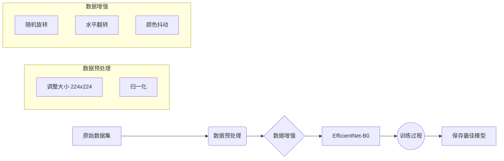
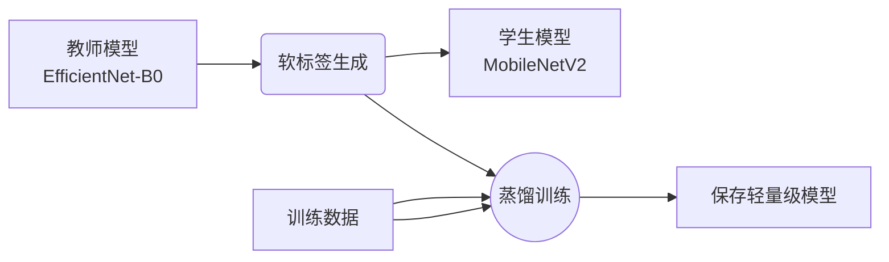
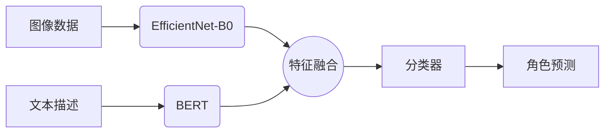

# 二次元角色检测与生成模型训练指南

本文档详细介绍了本项目中两个核心模型的训练流程：**图片检测模型**（用于识别角色）和**生成模型**（基于检测模型反推生成角色图像）。

---

## 1. 图片检测模型 (Character Detection Model)

检测模型是整个系统的基础，它负责识别图片中的二次元角色。我们使用 **EfficientNet-B0** 作为骨干网络，因为它在参数量和性能之间取得了很好的平衡。

### 1.1 训练流程图



### 1.2 关键步骤

1.  **数据准备**：
    *   将角色图片按文件夹分类存放在 `data/all_characters/` 目录下。
    *   每个文件夹的名称即为角色的标签（Label）。

2.  **模型架构**：
    *   **Backbone**: `EfficientNet-B0` (预训练权重)。
    *   **Head**: 修改最后的全连接层，输出维度等于角色类别数 (`num_classes`)。

3.  **训练策略**：
    *   **Loss**: CrossEntropyLoss (交叉熵损失)。
    *   **Optimizer**: AdamW。
    *   **Scheduler**: CosineAnnealingLR (余弦退火学习率)。

### 1.3 运行训练

使用以下命令启动检测模型训练：

```bash
# 运行分类脚本进行训练
python3 src/scripts/classification_script/classification_script.py
```

*(注：实际训练逻辑集成在 `src/core/classification` 或相关脚本中，请根据项目实际入口调整)*

---

## 2. 生成模型 (Detection Guided Generator)

这是一个高级功能，利用训练好的检测模型作为“指导老师”，教生成器如何画出特定的角色。

### 2.1 核心原理：对抗与指导

生成模型的训练是一个多方博弈的过程。我们不仅要让生成的图片**看起来真实**（骗过判别器），还要让它**被识别为特定角色**（骗过检测模型）。


*(示意图：生成器接收噪声和标签，输出图片。图片同时输入给判别器、检测模型和VGG网络计算损失)*

### 2.2 模型组件

| 组件 | 角色 | 状态 | 作用 |
| :--- | :--- | :--- | :--- |
| **Generator (G)** | 画家 | **训练中** | 从噪声中生成 $224 \times 224$ 的图像。采用 `Upsample` 结构消除网格伪影。 |
| **Discriminator (D)** | 鉴赏家 | **训练中** | 判断图片是“真图”还是“G画的假图”。 |
| **Detection Model** | 考官 | **冻结** | 检查生成的图片是否像目标角色（例如：是否像“初音未来”）。 |
| **VGG16** | 临摹参考 | **冻结** | 对比生成图和真实图的纹理细节（感知损失），保证画质。 |

### 2.3 损失函数设计

生成器的总损失 ($L_G$) 由三部分组成，共同指导生成方向：

1.  **对抗损失 ($L_{adv}$)**: 
    *   *目标*：让图片看起来像真的二次元图。
    *   *权重*：0.1
2.  **分类损失 ($L_{cls}$)**: 
    *   *目标*：让图片具备目标角色的特征（发色、瞳色、服饰等）。
    *   *权重*：0.2
3.  **感知损失 ($L_{perc}$)**: 
    *   *目标*：让图片的纹理、线条风格接近真实参考图。
    *   *权重*：**10.0** (高权重以保证高质量纹理)

### 2.4 训练步骤

1.  **准备检测模型**：确保你已经完成了第一步，拥有一个训练好的 `character_classifier.pth`。
2.  **启动训练**：

```bash
# 示例：训练第 0 类角色，迭代 3000 轮
python3 scripts/generate_from_detection.py \
    --target_class 0 \
    --num_epochs 3000 \
    --detection_model "models/character_classifier_best_improved.pth"
```

3.  **监控结果**：
    *   查看 `generated_images/` 目录。
    *   你会看到 `samples_epoch_X.png`，随着 epoch 增加，图片应从噪声逐渐变为清晰的角色图像。

### 2.5 常见问题与调优

*   **生成的图片有棋盘格/网格纹理？**
    *   *原因*：使用了 `ConvTranspose2d`。
    *   *解决*：本项目已优化为 `Upsample + Conv2d`，应已解决此问题。
*   **生成的图片不像目标角色？**
    *   *原因*：检测模型权重过低，或者加载了错误的参考图。
    *   *解决*：检查 `target_class` 是否对应正确的文件夹；适当增加分类损失权重。
*   **图片模糊？**
    *   *原因*：感知损失权重不足。
    *   *解决*：增大感知损失权重，或增加训练轮数。

---

## 3. 高级训练技术

### 3.1 模型蒸馏训练

模型蒸馏是一种模型压缩技术，通过让轻量级学生模型学习重量级教师模型的知识，在减小模型体积的同时保持性能。

#### 3.1.1 训练流程



#### 3.1.2 运行训练

使用以下命令启动模型蒸馏训练：

```bash
# 运行模型蒸馏训练
python3 scripts/model_training/train_model_distillation.py
```

### 3.2 在线学习系统

在线学习系统支持模型的持续更新和新角色的添加，无需重新训练整个网络。

#### 3.2.1 核心功能

*   **增量学习**：在线更新模型参数，适应新数据。
*   **新角色添加**：自动为新角色分配ID，并扩展分类器。
*   **特征数据库**：维护角色特征向量，加速识别过程。

#### 3.2.2 使用方法

```python
from scripts.model_training.online_learning_system import OnlineLearningSystem

# 初始化在线学习系统
online_learner = OnlineLearningSystem(
    model_path="models/character_classifier.pth",
    feature_db_path="data/feature_db"
)

# 添加新角色
new_role_name = "新角色"
new_role_images = ["path/to/image1.jpg", "path/to/image2.jpg"]
online_learner.add_new_role(new_role_name, new_role_images)

# 保存更新后的模型
online_learner.save_model("models/updated_model.pth")
```

### 3.3 多模态融合训练

多模态融合系统结合图像和文本信息，提升角色识别的准确性。

#### 3.3.1 训练流程



#### 3.3.2 运行训练

使用以下命令启动多模态融合训练：

```bash
# 运行多模态融合训练
python3 scripts/model_training/multimodal_fusion.py
```

## 4. 总结

| 模型 | 输入 | 输出 | 核心任务 |
| :--- | :--- | :--- | :--- |
| **检测模型** | 图片 | 角色标签 | **识别**：这是谁？ |
| **生成模型** | 噪声 + 标签 | 图片 | **创造**：画一个“初音未来”。 |
| **蒸馏模型** | 图片 | 角色标签 | **高效识别**：小模型，高性能。 |
| **在线学习模型** | 图片 + 新数据 | 角色标签 | **持续学习**：适应新角色。 |
| **多模态模型** | 图片 + 文本 | 角色标签 | **增强识别**：结合多种信息。 |

通过这些模型和技术的结合，本项目实现了从**理解图像**到**生成图像**的闭环，同时具备高效部署、持续学习和多模态增强的能力。