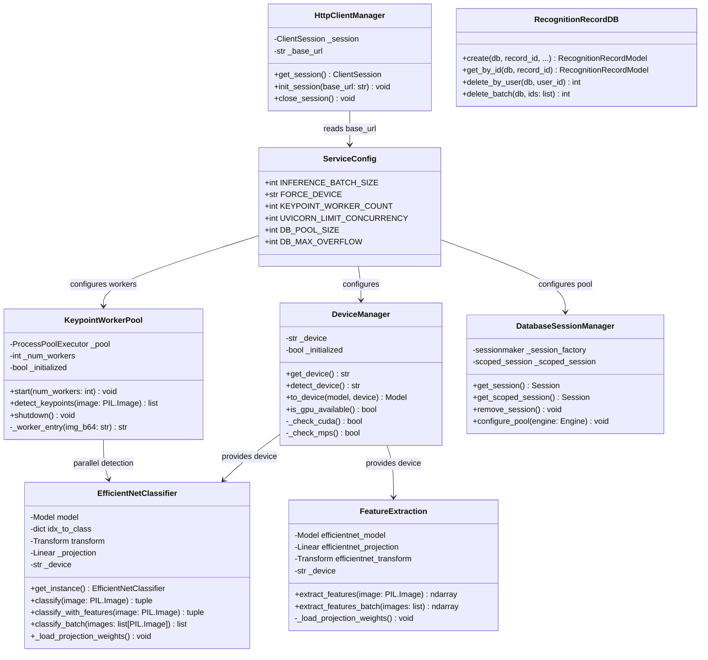
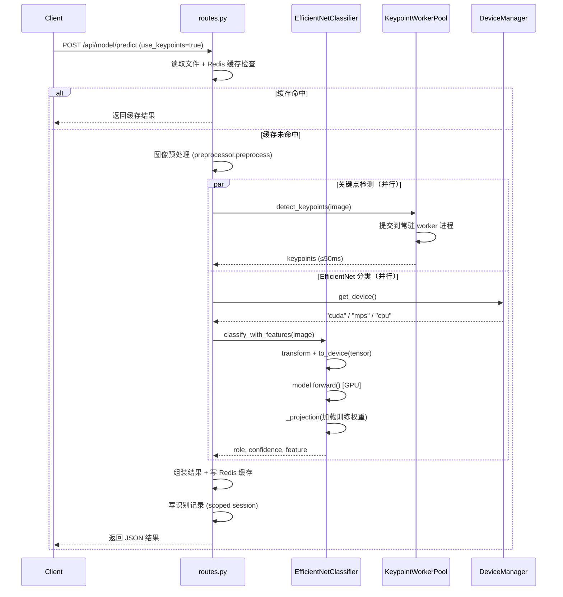
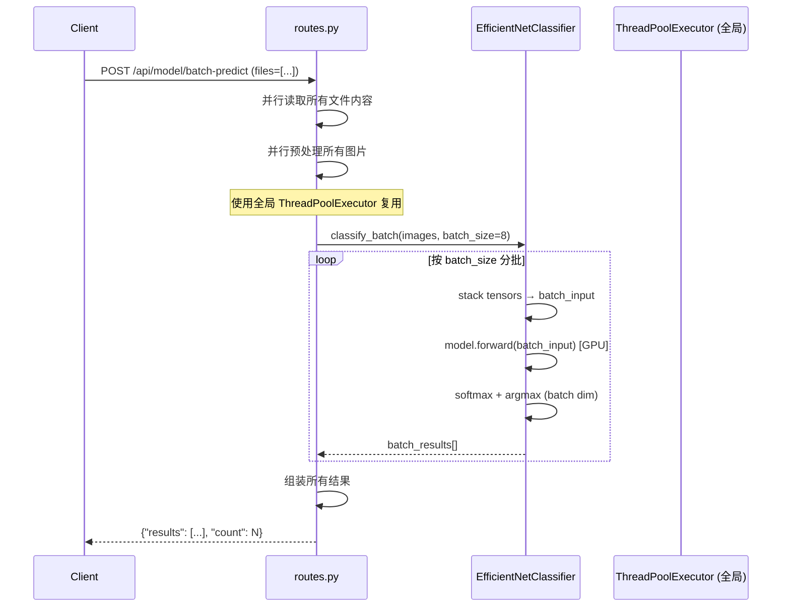
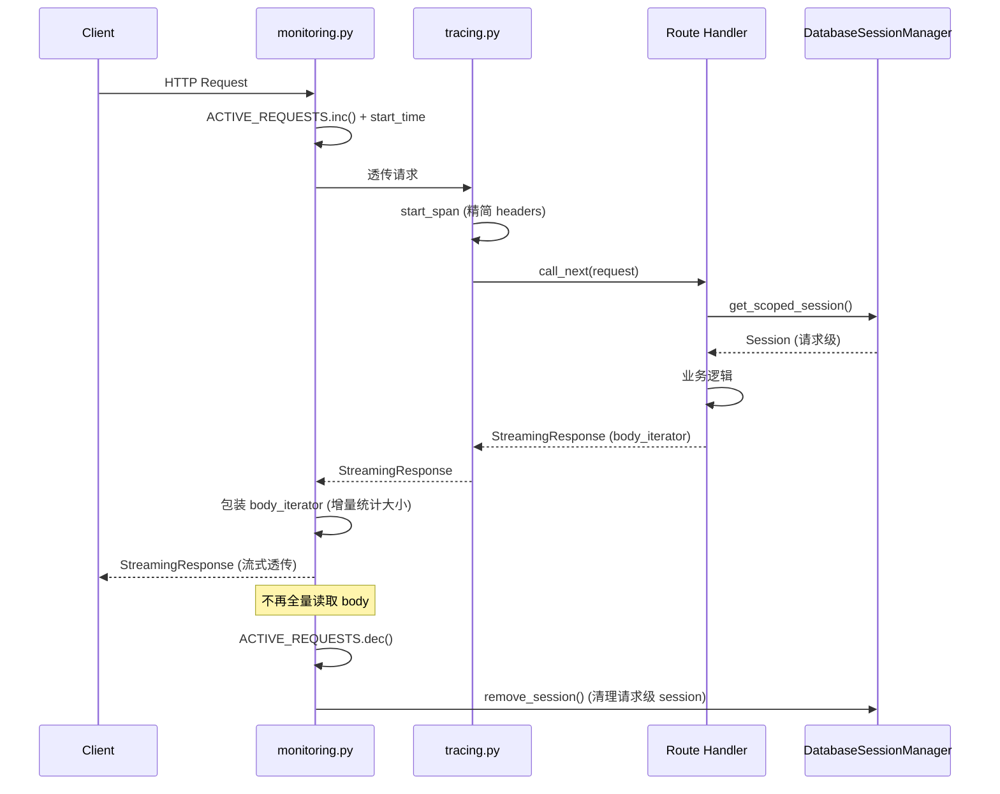
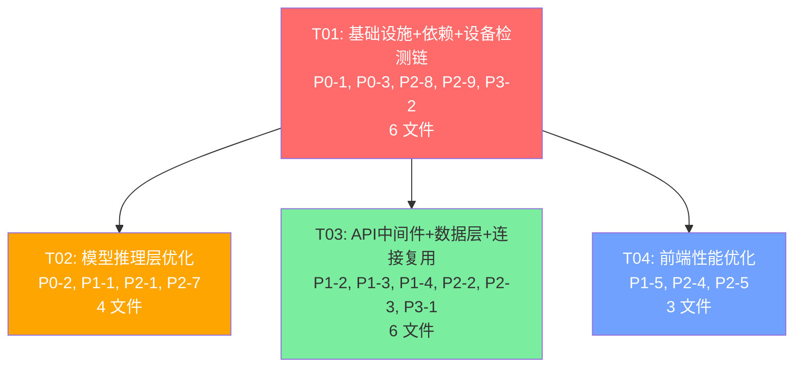

# anime_role_detect 性能优化 — 系统架构设计

> 架构师：高见远（Bob） | 基于产品经理许清楚的 PRD 与用户确认决策点

---

## Part A: 系统设计

### 1. 实现方案与框架选型

#### 1.1 核心技术挑战分析

| 挑战 | 现状痛点 | 优化目标 |
|------|---------|---------|
| GPU 推理被禁用 | `app.py` 强制 monkey-patch 禁用 MPS + `requirements.txt` 安装 CPU 版 torch | CUDA → MPS → CPU 自动回退链 |
| 关键点检测 fork 开销 | 每次 `subprocess.run()` fork 新进程 +2s | 常驻 worker 进程池复用 ≤50ms |
| 批量推理串行 | `for file in files` 逐张推理 | PyTorch batch 维度并行 ≥15 img/s |
| 响应体全量消费 | 监控中间件 `body += chunk` 全量读取重建 | 流式透传，零拷贝 |
| DB 连接池不合理 | SQLite `StaticPool` 单连接；全局 session 不关闭 | QueuePool + 请求级 scoped session |
| aiohttp 连接不复用 | 每次请求 `ClientSession()` 新建 | 应用级单例 + lifespan 管理 |
| 前端 dev 模式 | `npm run dev` + 无 Tree Shaking + 图片优化禁用 | 生产构建 + 图片优化 + 代码分割 |

#### 1.2 框架与库选型

| 组件 | 选型 | 理由 |
|------|------|------|
| PyTorch | `torch==2.1.0` (CUDA/MPS 原生版) | 移除 `+cpu` 后缀，支持 GPU 加速 |
| 进程池 | `concurrent.futures.ProcessPoolExecutor` | 标准库，保持进程隔离同时复用 worker |
| 连接池 (SQLite) | `sqlalchemy.pool.QueuePool` | 支持多连接并发，替代 StaticPool |
| HTTP 客户端 | `aiohttp.ClientSession` (单例) | 连接复用，通过 lifespan 管理生命周期 |
| 前端构建 | Next.js 15 生产模式 (`next build && next start`) | Tree Shaking + 代码压缩 |
| 前端图片优化 | Next.js Image Optimization (AVIF/WebP) | 自动格式转换 + 懒加载 |

#### 1.3 架构模式

- **设备管理层**：新增 `DeviceManager` 单例，统一管理 CUDA/MPS/CPU 检测与回退
- **进程池模式**：关键点检测使用常驻 `ProcessPoolExecutor`，在 lifespan 中初始化/销毁
- **单例模式**：`HttpClientManager` 管理全局 `aiohttp.ClientSession`
- **请求级作用域**：DB Session 改为请求级 scoped，通过 FastAPI Depends 注入

---

### 2. 文件列表

#### 2.1 后端 — 修改文件

| 文件路径 | 涉及需求 | 修改内容概述 |
|---------|---------|-------------|
| `requirements.txt` | P0-1 | `torch==2.1.0+cpu` → `torch==2.1.0`（根据平台自动选择 CUDA/CPU 版） |
| `supervisord.conf` | P0-3, P2-8, P2-9, P3-2 | 前端改 `npm start` + `NODE_ENV=production`；移除 `PYTORCH_MPS_DISABLE`；BLAS 线程解锁；进程资源配置 |
| `docker-compose.yml` | P2-6 | model-service `cpus: "1.5"` → `cpus: "4"` |
| `src/services/model_service/app.py` | P0-1, P2-8 | 移除 MPS monkey-patch；实现 CUDA→MPS→CPU 检测链；`limit_concurrency` 10→64；lifespan 管理 worker pool |
| `src/services/model_service/classifiers.py` | P0-1, P1-1, P2-7 | 模型加载 `map_location` 改为设备感知；新增 `classify_batch()` 批量推理；修复投影层权重加载 |
| `src/services/model_service/routes.py` | P0-2, P1-1, P2-1 | 关键点检测改用 worker pool；批量预测改用 batch 推理；全局 `ThreadPoolExecutor` 复用 |
| `src/core/feature_extraction/feature_extraction.py` | P2-7 | 修复随机投影层 → 加载训练好的投影权重；设备感知 |
| `src/middleware/monitoring.py` | P1-2 | 全量消费响应体 → 流式透传 + 增量统计 |
| `src/middleware/tracing.py` | P3-1 | 精简 `request.headers` 记录，仅保留关键头 |
| `src/core/config/database.py` | P1-3 | SQLite `StaticPool` → `QueuePool`；MySQL pool 参数调优 |
| `src/services/support/database_service.py` | P2-2, P2-3 | 全局单例 session → 请求级 scoped session；N+1 删除 → `DELETE WHERE id IN` |
| `src/services/processor/model_processor.py` | P1-4 | `aiohttp.ClientSession()` 每次新建 → 全局单例复用 |
| `src/api/lifecycle.py` | P1-4 | lifespan 中初始化/关闭 `HttpClientManager` 单例 |
| `src/core/config/service_config.py` | P0-1, P1-1 | 新增性能配置参数（batch_size, device, pool_size 等） |

#### 2.2 后端 — 新增文件

| 文件路径 | 涉及需求 | 内容概述 |
|---------|---------|---------|
| `src/services/model_service/keypoint_worker.py` | P0-2 | 关键点检测常驻 worker 进程池：`KeypointWorkerPool` 类 + worker 入口函数 |
| `src/core/config/device_manager.py` | P0-1 | `DeviceManager` 单例：CUDA→MPS→CPU 检测链 + 模型设备迁移 |

#### 2.3 前端 — 修改文件

| 文件路径 | 涉及需求 | 修改内容概述 |
|---------|---------|-------------|
| `src/frontend/next.config.js` | P1-5 | 移除 `unoptimized: true`；配置 AVIF/WebP 格式 |
| `src/frontend/app/utils/imageCompression.ts` | P2-4 | `for` 串行压缩 → `Promise.all` 并行压缩 |
| `src/frontend/app/page.tsx` | P2-5 | 静态导入 → `next/dynamic` 按需加载重型组件 |

---

### 3. 数据结构与接口（类图）



---

### 4. 程序调用流程（时序图）

#### 4.1 单张图片推理（GPU + 关键点 worker 池）



#### 4.2 批量预测（真 batch 推理）



#### 4.3 API 请求流式监控中间件



---

### 5. 待明确事项

| # | 待明确项 | 当前假设 | 影响范围 |
|---|---------|---------|---------|
| 1 | 训练好的投影层权重文件路径 | 假设存在 `models/efficientnet_b3_*/projection_weights.pth`，若无则保留 Xavier 初始化并记录 warning | P2-7: classifiers.py, feature_extraction.py |
| 2 | macOS MPS mutex 死锁是否已在 PyTorch 2.1+ 修复 | PRD 注释称"内核级信号量残留"，设计保留 `PYTORCH_ENABLE_MPS_FALLBACK=1` 作为安全网，但不再强制禁用 | P0-1: app.py |
| 3 | 生产环境是否使用 Docker 部署 model-service | 假设 Docker 环境有 CUDA GPU 支持，`requirements.txt` 需条件安装 GPU 版 torch | P0-1: requirements.txt |
| 4 | 关键点 worker 进程数默认值 | 假设默认 2 个 worker，可通过 `KEYPOINT_WORKER_COUNT` 环境变量配置 | P0-2: keypoint_worker.py |
| 5 | 前端代码分割后组件懒加载的 loading 状态设计 | 假设使用 `next/dynamic` 的 `loading` 属性显示简单 spinner | P2-5: page.tsx |
| 6 | 监控中间件流式透传后 Prometheus `RESPONSE_SIZE` 指标精度 | 假设通过包装 body_iterator 增量累加字节数，精度可接受 | P1-2: monitoring.py |

---

## Part B: 任务分解

### 6. 依赖包列表

#### Python (pip)

| 包名 | 版本 | 变更说明 |
|------|------|---------|
| `torch` | `2.1.0` | 移除 `+cpu` 后缀，根据平台自动安装 CUDA/MPS 版本 |
| `torchvision` | `0.16.0` | 移除 `+cpu` 后缀，同上 |
| `aiohttp` | `3.13.5` | 已有，无需变更（单例模式通过代码实现） |
| `sqlalchemy` | `2.0.50` | 已有，`QueuePool` 为内置无需新增 |

> **torch 安装说明**：Linux 生产环境使用 `pip install torch==2.1.0 --index-url https://download.pytorch.org/whl/cu121`；macOS 开发环境使用 `pip install torch==2.1.0`（自动含 MPS 支持）。

#### Node.js (npm)

| 包名 | 版本 | 变更说明 |
|------|------|---------|
| `next` | `15.5.18` | 已有，生产模式构建无需新增包 |
| `react` | `18.2.0` | 已有，无变更 |

> 前端优化均为配置/代码层面修改，无需新增 npm 依赖。

---

### 7. 任务列表（按实现顺序）

#### T01: 基础设施 + 依赖 + 设备检测链

| 属性 | 值 |
|------|---|
| **任务 ID** | T01 |
| **关联需求** | P0-1, P0-3, P2-8, P2-9, P3-2 |
| **优先级** | P0 |
| **依赖** | 无（首个任务） |
| **预估文件数** | 6 |

**修改内容**：

1. **`requirements.txt`** (P0-1)：将 `torch==2.1.0+cpu` 改为 `torch==2.1.0`，`torchvision==0.16.0+cpu` 改为 `torchvision==0.16.0`；添加注释说明 GPU 版安装方式
2. **`src/core/config/device_manager.py`** (新增, P0-1)：创建 `DeviceManager` 单例类，实现 `detect_device()` 方法：优先检测 CUDA → 其次 MPS（移除强制禁用）→ 最后 CPU 回退
3. **`src/services/model_service/app.py`** (P0-1, P2-8)：移除第 14-38 行的 MPS monkey-patch 和环境变量强制禁用；`get_optimal_device()` 改为委托 `DeviceManager`；`uvicorn.run(..., limit_concurrency=10)` 改为 `limit_concurrency=64`；BLAS 线程限制 (`OMP_NUM_THREADS=1` 等) 改为根据设备动态设置
4. **`supervisord.conf`** (P0-3, P2-9, P3-2)：`[program:frontend]` 的 `command` 从 `npm run dev` 改为 `npm start`，`environment` 中 `NODE_ENV` 从 `development` 改为 `production`；`[program:model-service]` 移除 `PYTORCH_MPS_DISABLE="1"`，BLAS 线程限制从 `"1"` 改为 `"4"`；优化 13 个进程的资源配置优先级
5. **`docker-compose.yml`** (P2-6)：model-service 的 `deploy.resources.limits.cpus` 从 `"1.5"` 改为 `"4"`
6. **`src/core/config/service_config.py`** (P0-1, P1-1)：新增配置字段：`INFERENCE_BATCH_SIZE: int = 8`、`FORCE_DEVICE: Optional[str] = None`、`KEYPOINT_WORKER_COUNT: int = 2`、`UVICORN_LIMIT_CONCURRENCY: int = 64`、`DB_POOL_SIZE: int = 5`、`DB_MAX_OVERFLOW: int = 10`

---

#### T02: 模型推理层优化

| 属性 | 值 |
|------|---|
| **任务 ID** | T02 |
| **关联需求** | P0-2, P1-1, P2-1, P2-7 |
| **优先级** | P0 |
| **依赖** | T01（依赖 DeviceManager 和 ServiceConfig 新增字段） |
| **预估文件数** | 4 |

**修改内容**：

1. **`src/services/model_service/keypoint_worker.py`** (新增, P0-2)：创建 `KeypointWorkerPool` 类，使用 `concurrent.futures.ProcessPoolExecutor` 管理常驻 worker 进程；提供 `start()` / `detect_keypoints(image)` / `shutdown()` 方法；worker 入口函数 `_worker_entry()` 在子进程内 lazy import mediapipe 并调用 `detect_keypoints`
2. **`src/services/model_service/routes.py`** (P0-2, P1-1, P2-1)：
   - 关键点检测：移除第 163-177 行的 `subprocess.run()` 内联代码，改为调用 `KeypointWorkerPool.detect_keypoints(image)`
   - 批量预测（第 574 行）：移除 `for file in files` 串行循环，改为并行预处理 + `EfficientNetClassifier.classify_batch()` 批量推理
   - ThreadPoolExecutor：将第 159、193、216、268 行的 `ThreadPoolExecutor(max_workers=1)` 局部创建改为模块级全局 `_executor = ThreadPoolExecutor(max_workers=4)` 复用
   - 在 `set_globals()` 中接收 `keypoint_pool` 引用
3. **`src/services/model_service/classifiers.py`** (P0-1, P1-1, P2-7)：
   - 第 57 行 `map_location="cpu"` 改为 `map_location=DeviceManager.get_device()`
   - 新增 `classify_batch(images: list)` 方法：将多张图片 stack 成 batch tensor，单次 `model.forward()` 推理
   - 第 121-125 行随机投影层：改为从 `models/efficientnet_b3_*/projection_weights.pth` 加载训练好的权重，文件不存在时 fallback 到 Xavier 初始化并 log warning
   - `classify()` 和 `classify_with_features()` 中 tensor 显式 `.to(device)`
4. **`src/core/feature_extraction/feature_extraction.py`** (P2-7)：
   - 第 214-215 行随机投影层：同 classifiers.py，改为加载训练好的投影权重
   - 模型和 tensor 显式 `.to(device)`，使用 `DeviceManager.get_device()`

---

#### T03: API 中间件 + 数据层 + 连接复用

| 属性 | 值 |
|------|---|
| **任务 ID** | T03 |
| **关联需求** | P1-2, P1-3, P1-4, P2-2, P2-3, P3-1 |
| **优先级** | P1 |
| **依赖** | T01（依赖 ServiceConfig 新增字段） |
| **预估文件数** | 6 |

**修改内容**：

1. **`src/middleware/monitoring.py`** (P1-2)：移除第 40-51 行全量消费 `body += chunk` + 重建 Response 的逻辑；改为包装 `response.body_iterator`，在透传 chunk 的同时增量累加 `RESPONSE_SIZE.observe()`，返回原始 `StreamingResponse`
2. **`src/middleware/tracing.py`** (P3-1)：第 71 行 `"request.headers": dict(request.headers)` 改为仅记录关键头：`{"content_type": ..., "content_length": ..., "user_agent": ..., "authorization": "***"}`
3. **`src/core/config/database.py`** (P1-3)：
   - 第 106-111 行 SQLite：`poolclass=StaticPool` 改为 `poolclass=QueuePool`，配置 `pool_size=5, max_overflow=10, pool_pre_ping=True`
   - 第 130-136 行 MySQL：`pool_size=10` 改为从 `ServiceConfig.DB_POOL_SIZE` 读取，`max_overflow=20` 改为从 `ServiceConfig.DB_MAX_OVERFLOW` 读取
4. **`src/services/support/database_service.py`** (P2-2, P2-3)：
   - 第 22-29 行 `get_db_service()` 全局单例 session：改为 `get_db_session()` 返回请求级 scoped session（每次调用创建新 session，调用方负责 close）
   - 第 134-144 行 `delete_by_user()` N+1 删除：改为 `db.query(...).filter(...).delete(synchronize_session=False)` 批量删除
5. **`src/services/processor/model_processor.py`** (P1-4)：第 83 行 `async with aiohttp.ClientSession() as session:` 改为 `session = HttpClientManager.get_session()`，移除 `async with` 上下文管理（session 由全局管理）
6. **`src/api/lifecycle.py`** (P1-4)：在 `_init_services()` 中新增 `HttpClientManager.init_session()` 初始化；在 `app.py` 的 `lifespan` shutdown 阶段调用 `HttpClientManager.close_session()`

---

#### T04: 前端性能优化

| 属性 | 值 |
|------|---|
| **任务 ID** | T04 |
| **关联需求** | P1-5, P2-4, P2-5 |
| **优先级** | P1 |
| **依赖** | T01（依赖 supervisord.conf 前端生产模式配置） |
| **预估文件数** | 3 |

**修改内容**：

1. **`src/frontend/next.config.js`** (P1-5)：移除 `unoptimized: true`；配置 `images.formats: ['image/avif', 'image/webp']`；配置合理的 `images.deviceSizes` 和 `images.imageSizes`
2. **`src/frontend/app/utils/imageCompression.ts`** (P2-4)：第 159 行 `compressImages()` 函数中的 `for (const file of files)` 串行循环改为 `Promise.all(files.map(f => compressImage(f, options)))` 并行压缩；添加并发限制（如 `p-limit` 模式或手动分批）避免内存溢出
3. **`src/frontend/app/page.tsx`** (P2-5)：
   - 将 `import HistoryPanel`、`import SearchPanel`、`import VideoPanel`、`import CleaningPanel` 等重型组件改为 `next/dynamic` 懒加载
   - 配置 `dynamic(() => import(...), { loading: () => <Spinner />, ssr: false })` 对非首屏组件
   - 保留 `Header`、`ChatPanel` 等首屏组件为静态导入

---

### 8. 共享知识（跨文件约定）

```
# 设备管理
- DeviceManager 是全局单例，所有模块通过 DeviceManager.get_device() 获取当前推理设备
- 设备检测链：CUDA → MPS → CPU，检测顺序不可更改
- MPS 环境保留 PYTORCH_ENABLE_MPS_FALLBACK=1 作为安全网，但不再设置 PYTORCH_MPS_DISABLE=1

# 进程池
- KeypointWorkerPool 在 model_service lifespan 中初始化，通过 set_globals() 传递给 routes
- worker 进程内不导入 torch（避免与主进程 MPS 冲突），仅导入 mediapipe
- ThreadPoolExecutor 全局复用：routes.py 模块级 _executor，不在函数内创建新实例

# 批量推理
- classify_batch() 按 INFERENCE_BATCH_SIZE（默认 8）分批，自动 stack/unsqueeze
- batch 输入 tensor shape: (B, 3, 224, 224)，输出 (B, num_classes)
- 投影层权重路径约定：models/{model_name}/projection_weights.pth，文件不存在时 fallback Xavier

# 数据库
- SQLite 使用 QueuePool（pool_size=5），MySQL 使用 QueuePool（pool_size 从 ServiceConfig 读取）
- DB Session 不再使用全局单例 _db_session，改为请求级 scoped session
- 调用方获取 session 后必须 close 或通过 FastAPI Depends(get_db) 自动管理

# HTTP 客户端
- HttpClientManager.get_session() 返回全局单例 aiohttp.ClientSession
- 禁止在业务代码中使用 async with aiohttp.ClientSession() 创建新 session
- session 在应用 lifespan 中初始化和关闭

# 中间件
- 监控中间件不再全量消费响应体，通过包装 body_iterator 流式透传
- 追踪中间件仅记录 content_type, content_length, user_agent, authorization(脱敏) 四个关键头

# 前端
- 生产模式运行：npm run build && npm start（supervisord 管理）
- 图片优化：Next.js Image 组件自动处理 AVIF/WebP 转换 + 懒加载
- 代码分割：非首屏组件使用 next/dynamic 懒加载，首屏组件保持静态导入

# 配置约定
- 所有性能参数集中在 ServiceConfig 中，通过环境变量覆盖
- 环境变量命名：大写下划线（如 INFERENCE_BATCH_SIZE, KEYPOINT_WORKER_COUNT）
```

---

### 9. 任务依赖图



**依赖说明**：
- **T01 → T02**：T02 的模型推理需要 T01 的 `DeviceManager` 提供设备信息
- **T01 → T03**：T03 的数据库连接池需要 T01 的 `ServiceConfig` 新增字段
- **T01 → T04**：T04 的前端生产模式需要 T01 的 `supervisord.conf` 配置
- **T02、T03、T04 之间无依赖**：可并行开发，但实现顺序建议 T02 → T03 → T04

---

### 附录：需求覆盖矩阵

| 需求 ID | 优先级 | 分配任务 | 覆盖状态 |
|---------|--------|---------|---------|
| P0-1 | P0 | T01 | ✅ |
| P0-2 | P0 | T02 | ✅ |
| P0-3 | P0 | T01 | ✅ |
| P1-1 | P1 | T02 | ✅ |
| P1-2 | P1 | T03 | ✅ |
| P1-3 | P1 | T03 | ✅ |
| P1-4 | P1 | T03 | ✅ |
| P1-5 | P1 | T04 | ✅ |
| P2-1 | P2 | T02 | ✅ |
| P2-2 | P2 | T03 | ✅ |
| P2-3 | P2 | T03 | ✅ |
| P2-4 | P2 | T04 | ✅ |
| P2-5 | P2 | T04 | ✅ |
| P2-6 | P2 | T01 | ✅ |
| P2-7 | P2 | T02 | ✅ |
| P2-8 | P2 | T01 | ✅ |
| P2-9 | P2 | T01 | ✅ |
| P3-1 | P3 | T03 | ✅ |
| P3-2 | P3 | T01 | ✅ |
| P3-3 | P3 | T01 | ✅ (supervisord 进程精简) |
