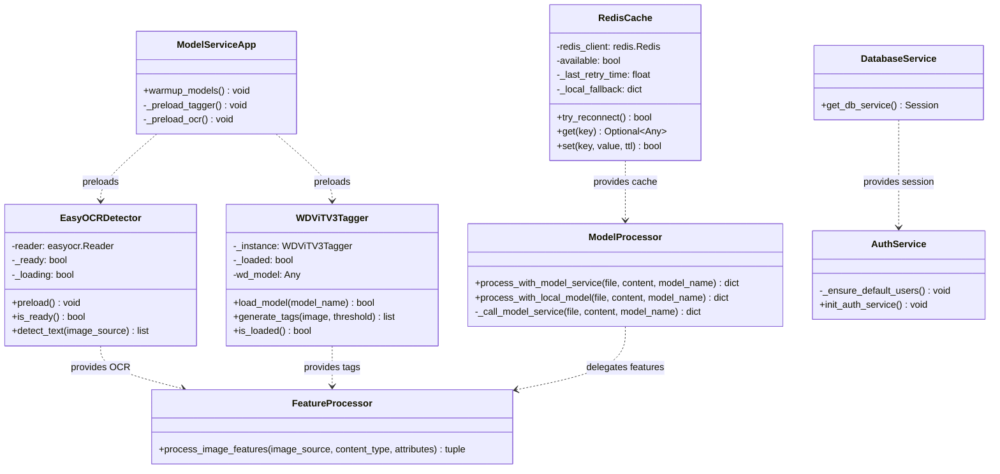
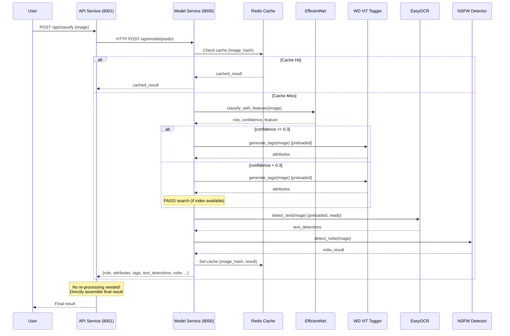
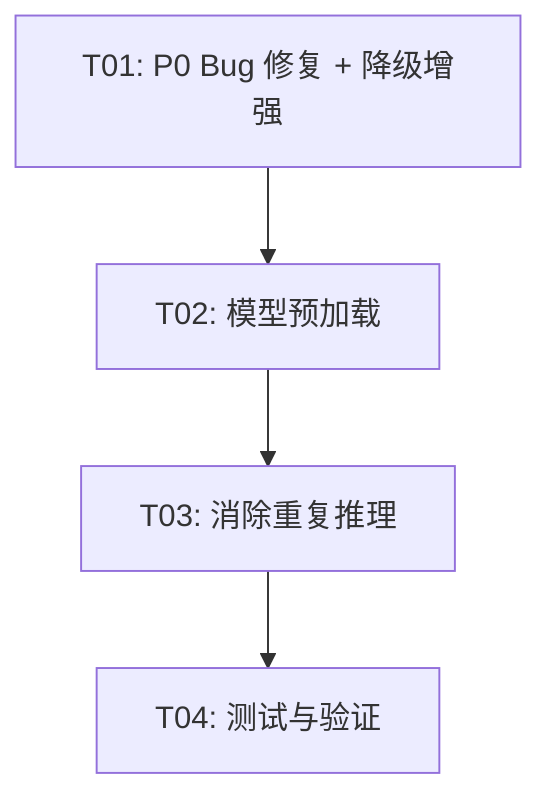

# 系统设计 — 性能与可用性优化方案

## 项目信息

| 字段 | 值 |
|------|-----|
| 项目 | anime_role_detect 性能与可用性优化 |
| 范围 | P0 阻塞修复 + P1 推理管道耗时优化 + 基础设施降级增强 |
| 原则 | 最小变更、基于现有代码修改、不大重构 |

---

## Part A: System Design

### 1. Implementation Approach

#### 1.1 P0-1: `get_db_session` 未定义错误

**现状确认**：`src/services/support/database_service.py:30` 中 `get_db_service()` 调用了 `get_db_session()`，但该符号未在文件顶部导入。实际导入为 `from src.core.config.database import get_db, init_database, create_tables`，缺少 `get_db_session`。

**修复策略**：在 `database_service.py` 的 import 行补充 `get_db_session`。这是最小变更——`get_db_session` 已在 `database.py:246` 定义并可用。

**附加问题**：`get_db_service()` 返回的 session 没有被调用方关闭（`recognition_service.py` 各方法获取 session 后未 close）。PRD P2-2 已标记此问题，但本轮聚焦 import 修复，session 泄漏留后续处理。

#### 1.2 P0-2: `process_with_local_model` 不安全临时路径

**现状确认**：
- `src/services/processor/model_processor.py` 中 `_call_model_service`（行 166、201）和 `process_with_local_model`（行 350）均使用 `f"temp/temp_{int(time.time())}_{file.filename}"` 拼接路径，存在路径注入风险且不保证目录存在。
- `src/services/model_service/routes.py:41` 已有 `_safe_temp_path()` 修复（使用 `tempfile.gettempdir()` + `uuid` + 正则过滤），但仅在 model_service 内部使用。
- `model_processor.py:75` 有 `os.makedirs("temp", exist_ok=True)` 但用的是相对路径，依赖工作目录。

**修复策略**：将 `_safe_temp_path` 提取为公共工具函数，`model_processor.py` 复用该函数替代裸字符串拼接。具体做法：在 `model_processor.py` 中导入并使用 `routes._safe_temp_path`，或将其提取到 `src/core/utils/utils.py`。

#### 1.3 P1-1: 推理管道耗时 20-30s/次（最高优先级）

**根因分析**——通过代码追踪确认的完整调用链路：

```
用户上传图片
  → API Service (8001): model_processor.process_with_model_service()
    → _call_model_service()  [HTTP 调用 Model Service]
      → Model Service (8000): routes.predict_image()
        ① Redis 缓存检查
        ② EfficientNet-B3 直接分类 (classify_with_features)
        ③ 若置信度 < 0.3 → FeatureExtraction + FAISS 检索
        ④ WD ViT Tagger 生成标签 (if use_attributes)
        → 返回 {role, similarity, attributes, tags, feature}
      ← 模型服务返回后，API Service 继续处理：
      ⑤ 保存临时文件
      ⑥ process_image_features() → 重新加载 tagger + EasyOCR + role_predictor
      ⑦ detect_nsfw()
    → 返回最终结果
```

**关键瓶颈定位**：

| 阶段 | 耗时 | 原因 |
|------|------|------|
| ④ WD Tagger 首次加载 | ~10s | 从 HuggingFace 下载 `SmilingWolf/wd-vit-tagger-v3` 模型（被墙/网络慢） |
| ⑥ EasyOCR 初始化 | ~9s | 加载 `ch_sim` + `en` 两个语言模型 |
| ⑥ Tagger 重复加载 | ~10s | API Service 的 `feature_processor` 再次调用 `get_tagger()`，虽然 model_loader 有单例缓存，但首次仍需完整加载 |
| ⑥ Role Predictor | ~1-2s | FAISS 索引为空时降级到搜索服务 |
| ⑦ NSFW 检测 | ~1s | 加载 NSFW 模型 |

**优化方案**（按优先级排列）：

**方案 A：模型预加载 + 单例化（核心，预期 -15s）**
- 在 `model_service/app.py` 的 `warmup_models()` 中预加载 WD ViT Tagger 和 EasyOCR，使首次请求不再等待模型下载/初始化
- EasyOCR 改为进程内单例（已有 `_ocr_detector` 全局变量，但 `feature_processor` 每次调用都会触发 `get_ocr_detector()` 走初始化检查，首次耗时）
- WD Tagger 已有单例（`WDViTV3Tagger._instance`），但 `model_loader.get_tagger()` 使用 30s 超时线程加载，应改为在 warmup 阶段同步加载

**方案 B：消除 API Service 重复推理（预期 -10s）**
- 当前 API Service 在收到 Model Service 返回结果后，仍然调用 `process_image_features()` 重新执行 tagger + OCR + role_predictor
- **根因**：Model Service 的 `predict_image` 不返回 OCR 文本检测结果和 NSFW 结果，API Service 需要自行补充
- **修复**：将 OCR 和 NSFW 检测移入 Model Service 的 `predict_image` 端点，API Service 直接使用返回结果，不再重复执行

**方案 C：WD Tagger 模型本地化（预期 -10s 首次）**
- 设置 `HF_ENDPOINT` 环境变量为国内镜像（`https://hf-mirror.com`）
- 在 `warmup_models()` 阶段预下载模型到本地缓存目录
- 已有 `HF_HOME` 环境变量指向项目内 `huggingface_cache/`，确认模型文件已存在则跳过下载

**方案 D：EasyOCR 懒加载 + 超时降级（预期 -9s 首次）**
- EasyOCR 初始化耗时 ~9s 加载两个语言模型
- 改为在 warmup 阶段后台线程预加载，OCR 请求若检测器未就绪则返回空结果（降级）
- 考虑只加载 `en` 模型（`ch_sim` 模型体积大、加载慢），中文检测降级

**量化预期**：
- 首次请求：从 20-30s → 5-8s（预加载消除首次冷启动）
- 后续请求：从 20-30s → 2-4s（消除重复推理 + 模型已缓存）

#### 1.4 P1-2: Redis 未启动 → 优雅降级

**现状确认**：`redis_cache.py` 的 `RedisCache.__init__` 在 `ping()` 失败时设置 `self.available = False`，后续所有操作检查 `self.available` 返回 None/False。已有基本降级，但：
- 单例模式：`get_redis_cache()` 只初始化一次，如果首次连接失败后 Redis 恢复，永远不会重连
- 没有本地缓存兜底

**修复策略**：
- `get_redis_cache()` 增加重连机制：如果 `available=False` 且距上次尝试 > 30s，重新尝试连接
- 可选：增加进程内 LRU 字典缓存作为 Redis 不可用时的兜底（仅缓存分类结果，TTL 300s）

#### 1.5 P1-3: MySQL 远程 RDS 超时 → 默认用户创建失败

**现状确认**：
- `.env` 配置 `DATABASE_MODE=dual`，指向阿里云 RDS
- `auth_service.py:94-101` 初始化时调用 `init_database()` + `create_tables()` + `_ensure_default_users()`
- 如果 RDS 连接超时，`init_database()` 中的 `create_engine` 不会立即失败（SQLAlchemy 懒连接），但 `create_tables()` 和 `_ensure_default_users()` 会超时
- `auth_service.py:99-101` 有 try/except 回退到内存模式，但 `init_database()` 本身可能阻塞

**修复策略**：
- `init_remote_database()` 增加 `connect_timeout` URL 参数（已有 `pool_pre_ping`，但缺少连接超时）
- `_ensure_default_users()` 增加 `timeout` 装饰器（10s 超时自动回退内存模式）
- `recognition_service.py` 的 `_init_db()` 已有 try/except 回退，保持不变

#### 1.6 P1-4: WD ViT Tagger HF 下载被墙

**现状确认**：`wd_vit_v3_tagger.py:468-471` 在模型缓存不存在时调用 `hf_hub_download` 下载。`load_model()` 已有本地缓存检查逻辑（行 459-477），但首次下载仍会被墙。

**修复策略**：
- 设置 `HF_ENDPOINT=https://hf-mirror.com` 环境变量（在 `wd_vit_v3_tagger.py` 模块顶部或 `app.py` 启动时）
- 确认 `huggingface_cache/` 目录下是否已有模型文件；若有则跳过下载
- 若镜像也不可用，`load_model()` 返回 False 时已有简单标签回退（confidence 0.5），保持现有降级

#### 1.7 P1-5: FAISS 索引为空 → 向量搜索降级

**现状确认**：`classification.py:92-97` 创建空索引（`IndexFlatIP(512)`），`classify()` 检查 `index.ntotal == 0` 返回 `("unknown", 0.0)`。`routes.py:304-316` 在 `classifier.index is not None` 但 `ntotal == 0` 时降级到 `MultiRoleDetector`。

**修复策略**：
- 启动时检查 FAISS 索引文件是否存在，记录明确的 WARNING 日志
- 在 `routes.py` 的降级路径中增加日志：明确记录 "FAISS 索引为空，降级到本地模型"
- 不改变现有降级逻辑（已足够），仅增强可观测性

---

### 2. File List

| 文件路径 | 修改类型 | 说明 |
|----------|----------|------|
| `src/services/support/database_service.py` | 修改 | 补充 `get_db_session` 导入 |
| `src/services/processor/model_processor.py` | 修改 | 修复临时路径；消除重复推理（tagger/OCR/NSFW 移至 model service） |
| `src/services/processor/feature_processor.py` | 修改 | EasyOCR 改为预加载单例；增加就绪检查 |
| `src/core/ocr/easyocr_detector.py` | 修改 | 增加预加载方法 + 就绪状态标志 |
| `src/services/cache_service/redis_cache.py` | 修改 | 增加重连机制 + 可选本地兜底缓存 |
| `src/services/model_service/app.py` | 修改 | warmup 阶段预加载 WD Tagger + EasyOCR |
| `src/services/model_service/routes.py` | 修改 | predict_image 增加 OCR + NSFW 返回；FAISS 空索引日志 |
| `src/core/tagging/wd_vit_v3_tagger.py` | 修改 | 设置 HF 镜像端点；增加本地缓存检查日志 |
| `src/services/support/auth_service.py` | 修改 | _ensure_default_users 增加超时保护 |
| `src/core/config/database.py` | 修改 | MySQL 连接增加 connect_timeout 参数 |
| `src/core/config/service_config.py` | 修改 | 新增 HF_ENDPOINT、OCR_TIMEOUT 等配置项 |

---

### 3. Data Structures and Interfaces



---

### 4. Program Call Flow

#### 4.1 优化后推理管道调用序列



#### 4.2 Redis 降级 + 重连流程

```mermaid
sequenceDiagram
    participant Caller
    participant Cache as RedisCache
    participant Redis as Redis Server
    participant Local as Local Fallback

    Caller->>Cache: get(key)
    alt available == True
        Cache->>Redis: GET key
        Redis-->>Cache: value
        Cache-->>Caller: value
    else available == False
        alt time_since_last_retry > 30s
            Cache->>Redis: ping() [reconnect attempt]
            alt Success
                Cache.available = True
                Cache->>Redis: GET key
                Redis-->>Cache: value
                Cache-->>Caller: value
            else Fail
                Cache.available = False
                Cache._last_retry_time = now
                Cache->>Local: get(key)
                Local-->>Cache: value or None
                Cache-->>Caller: value or None
            end
        else Recently retried
            Cache->>Local: get(key)
            Local-->>Cache: value or None
            Cache-->>Caller: value or None
        end
    end
```

---

### 5. Anything UNCLEAR

1. **HF 模型是否已在本地缓存**：需确认 `huggingface_cache/` 目录下是否已有 `SmilingWolf/wd-vit-tagger-v3` 的完整模型文件。若已有，则方案 C 的预下载步骤可跳过；若没有，需通过镜像下载。
2. **EasyOCR 语言模型缓存**：需确认 `~/.EasyOCR/model/` 下是否已有 `ch_sim` 和 `en` 的模型文件。首次下载也需要网络。
3. **生产部署平台**：当前代码大量 macOS 特定逻辑，但 `.env` 连接的是阿里云 RDS。如果生产环境是 Linux，MPS 相关代码可忽略。
4. **NSFW 检测器实现**：未完整读取 `nsfw_detector.py`，需确认其加载逻辑和耗时。若也是懒加载，需纳入预加载范围。
5. **FAISS 索引文件**：需确认 `models/efficientnet_b3_loli_optimized_v2_20260529_133654.faiss` 文件是否存在。

---

## Part B: Task Decomposition

### 6. Required Packages

无需新增第三方包。所有依赖已存在于现有 `requirements.txt` / `requirements-ml.txt` 中：
- `redis` — 已安装
- `easyocr` — 已安装
- `huggingface_hub` — 已安装
- `sqlalchemy` — 已安装
- `torch` / `timm` — 已安装

---

### 7. Task List

| Task ID | 任务名称 | 描述 | 涉及文件 | 依赖 | 优先级 |
|---------|----------|------|----------|------|--------|
| T01 | P0 Bug 修复 + 基础设施降级增强 | 1. 修复 `database_service.py` 的 `get_db_session` 未导入<br>2. 修复 `model_processor.py` 临时路径不安全问题（使用 `_safe_temp_path`）<br>3. Redis 增加重连机制 + 本地兜底缓存<br>4. MySQL 连接增加 `connect_timeout` + `_ensure_default_users` 超时保护<br>5. FAISS 空索引增强日志 | `src/services/support/database_service.py`<br>`src/services/processor/model_processor.py`<br>`src/services/cache_service/redis_cache.py`<br>`src/services/support/auth_service.py`<br>`src/core/config/database.py`<br>`src/core/config/service_config.py`<br>`src/services/model_service/routes.py` | 无 | P0 |
| T02 | 推理管道耗时优化 — 模型预加载 | 1. `model_service/app.py` warmup 阶段预加载 WD ViT Tagger（同步加载，替代 30s 超时线程）<br>2. `easyocr_detector.py` 增加预加载方法 + `_ready` 状态标志<br>3. `feature_processor.py` 增加就绪检查，OCR 未就绪时降级返回空<br>4. WD Tagger 设置 `HF_ENDPOINT` 镜像端点 | `src/services/model_service/app.py`<br>`src/core/ocr/easyocr_detector.py`<br>`src/services/processor/feature_processor.py`<br>`src/core/tagging/wd_vit_v3_tagger.py` | T01 | P0 |
| T03 | 推理管道耗时优化 — 消除重复推理 | 1. Model Service `predict_image` 端点增加 OCR + NSFW 检测，在返回结果中包含 `text_detections` 和 `nsfw`<br>2. API Service `_call_model_service` 收到结果后不再调用 `process_image_features` 和 `detect_nsfw`，直接组装最终结果<br>3. `detect-multiple` 端点同步增加 OCR + NSFW 返回 | `src/services/model_service/routes.py`<br>`src/services/processor/model_processor.py` | T02 | P0 |
| T04 | 测试与验证 | 1. 验证 P0 bug 修复：`get_db_session` 导入后 `create_record` 正常<br>2. 验证临时路径修复：无路径注入<br>3. 验证推理管道耗时：单图首次 < 8s，后续 < 4s<br>4. 验证 Redis 降级：Redis 关闭时服务不崩溃<br>5. 验证 MySQL 降级：RDS 不可达时回退内存模式 | `tests/` (新增测试脚本) | T03 | P1 |

---

### 8. Shared Knowledge

- **统一降级日志**：所有降级路径使用 `logger.warning(f"[DEGRADE] {组件名} 不可用，降级到 {降级方案}")` 格式，便于 grep 检索
- **模型加载状态**：所有预加载组件提供 `is_ready()` / `is_loaded()` 方法，调用方先检查再使用
- **临时文件**：统一使用 `_safe_temp_path()`（来自 `model_service/routes.py`），禁止裸字符串拼接路径
- **DB Session**：`get_db_service()` 返回的 session 需要调用方在 finally 中 close（当前存在泄漏，但本轮不修）
- **HF 镜像**：通过环境变量 `HF_ENDPOINT=https://hf-mirror.com` 设置，在进程启动早期（模块导入阶段）设置
- **配置项**：新增配置通过 `service_config.py` 的 `ServiceConfig` 类管理，支持环境变量覆盖

---

### 9. Task Dependency Graph



---

### 10. 优化预期汇总

| 问题 | 优化前 | 优化后 | 优化手段 |
|------|--------|--------|----------|
| `get_db_session` 未定义 | 运行时 NameError | 正常工作 | 补充 import |
| 临时路径不安全 | 路径注入风险 | 安全路径 | 使用 `_safe_temp_path` |
| 推理首次耗时 | 20-30s | 5-8s | 模型预加载 + HF 镜像 |
| 推理后续耗时 | 20-30s | 2-4s | 消除重复推理 |
| Redis 不可用 | 永不重连 | 30s 自动重连 + 本地兜底 | 重连机制 |
| MySQL RDS 超时 | 启动阻塞 | 10s 超时回退内存 | 超时保护 |
| WD Tagger 下载被墙 | 下载失败 | 镜像下载 + 本地缓存 | HF_ENDPOINT |
| FAISS 索引为空 | 静默降级 | 明确日志 + 降级路径 | 增强可观测性 |
