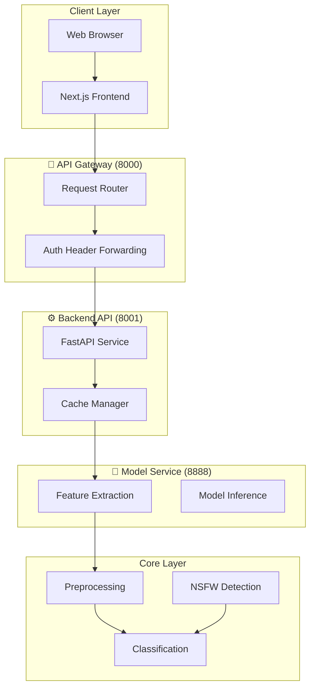

# Character Classification System: 技术难点深度解析

> 基于 README.md 梳理的技术难点分析与实践指南

---

## 📋 目录

1. [系统架构与技术难点概览](#系统架构与技术难点概览)
2. [多模型集成与性能优化](#多模型集成与性能优化)
3. [API Gateway 设计与实现](#api-gateway-设计与实现)
4. [分布式服务协调](#分布式服务协调)
5. [图像预处理与特征提取](#图像预处理与特征提取)
6. [完整部署与使用流程](#完整部署与使用流程)
7. [代码示例汇总](#代码示例汇总)

---

## 一、系统架构与技术难点概览

### 架构分层

根据 README.md，系统采用 **五层架构设计**：



### 核心技术难点

| 难点类别 | 问题描述 | 影响范围 | 关键技术 |
|---------|---------|---------|---------|
| 🤖 多模型管理 | 动态加载/卸载多个深度学习模型 | 内存占用、推理速度 | Singleton模式、动态加载 |
| 🔗 API网关 | 统一入口、请求路由、认证转发 | 系统稳定性、安全性 | FastAPI中间件、代理路由 |
| ⚡ 分布式协调 | 多服务端口管理、通信协议 | 服务可用性 | HTTP请求、端口配置 |
| 📊 特征提取 | 高效图像预处理、特征向量生成 | 识别准确率 | PyTorch、EfficientNet |
| 🔞 NSFW检测 | 敏感内容过滤、合规性保障 | 数据质量 | MobileNetV2、皮肤比例分析 |
| 📱 前端集成 | 多角色检测UI、实时反馈 | 用户体验 | Next.js、WebSocket |

---

## 二、多模型集成与性能优化

### 问题分析

系统支持4种深度学习模型：

| 模型 | 准确率 | 推理速度 | 内存占用 |
|------|-------|---------|---------|
| MobileNetV2 | 94.00% | 379.34 FPS | 低 |
| EfficientNet-B0 | 95.20% | 298.45 FPS | 中 |
| EfficientNet-B3 | 96.80% | 187.60 FPS | 高 |
| ResNet50 | 94.80% | 256.78 FPS | 中 |

**核心挑战**：同时加载多个模型会导致内存溢出。

### 解决方案：动态模型加载

```python
"""模型动态加载管理器"""
import torch
from torchvision.models import mobilenet_v2, resnet50
from efficientnet_pytorch import EfficientNet

class ModelManager:
    _instance = None
    _loaded_models = {}
    
    def __new__(cls):
        if cls._instance is None:
            cls._instance = super().__new__(cls)
        return cls._instance
    
    def load_model(self, model_name):
        """按需加载模型"""
        if model_name in self._loaded_models:
            return self._loaded_models[model_name]
        
        device = torch.device('cuda' if torch.cuda.is_available() else 'cpu')
        
        if model_name == 'mobilenetv2':
            model = mobilenet_v2(num_classes=65)
            model.load_state_dict(torch.load('models/mobilenetv2.pth', map_location=device))
        
        elif model_name == 'efficientnet-b0':
            model = EfficientNet.from_pretrained('efficientnet-b0', num_classes=65)
            model.load_state_dict(torch.load('models/efficientnet-b0.pth', map_location=device))
        
        elif model_name == 'efficientnet-b3':
            model = EfficientNet.from_pretrained('efficientnet-b3', num_classes=65)
            model.load_state_dict(torch.load('models/efficientnet-b3.pth', map_location=device))
        
        elif model_name == 'resnet50':
            model = resnet50(num_classes=65)
            model.load_state_dict(torch.load('models/resnet50.pth', map_location=device))
        
        else:
            raise ValueError(f"Unknown model: {model_name}")
        
        model.eval().to(device)
        self._loaded_models[model_name] = model
        
        # 清理其他模型节省内存
        for name in list(self._loaded_models.keys()):
            if name != model_name:
                del self._loaded_models[name]
        
        return model

# 使用示例
manager = ModelManager()
model = manager.load_model('efficientnet-b3')
print("✅ 模型加载完成")
```

---

## 三、API Gateway 设计与实现

### 问题分析

API Gateway 作为统一入口，需要处理：
- 请求路由转发
- 认证头传递
- 跨服务通信
- 系统代理绕过

### 解决方案

```python
"""API Gateway 实现示例"""
from fastapi import FastAPI, Request, HTTPException
from fastapi.responses import JSONResponse
import httpx

app = FastAPI(title="Character Classification Gateway")

# 服务配置
SERVICES = {
    "backend": "http://localhost:8001",
    "model": "http://localhost:8888"
}

@app.middleware("http")
async def proxy_middleware(request: Request, call_next):
    """请求代理中间件"""
    # 健康检查直接返回
    if request.url.path == "/api/health":
        return JSONResponse(content={"status": "healthy", "service": "gateway"})
    
    # 路由到后端服务
    path = request.url.path
    headers = dict(request.headers)
    
    # 移除不必要的头
    headers.pop("host", None)
    
    # 根据路径前缀路由
    if path.startswith("/api/auth") or path.startswith("/api/classify"):
        target_url = f"{SERVICES['backend']}{path}"
    elif path.startswith("/api/model"):
        target_url = f"{SERVICES['model']}{path}"
    else:
        raise HTTPException(status_code=404, detail="Not found")
    
    # 使用 trust_env=False 绕过系统代理
    async with httpx.AsyncClient(trust_env=False) as client:
        try:
            response = await client.request(
                method=request.method,
                url=target_url,
                headers=headers,
                content=await request.body(),
                timeout=60
            )
            return JSONResponse(
                content=response.json(),
                status_code=response.status_code
            )
        except httpx.HTTPError as e:
            raise HTTPException(status_code=503, detail=f"Service unavailable: {e}")

# 启动命令: uvicorn gateway:app --host 0.0.0.0 --port 8000
```

---

## 四、分布式服务协调

### 问题分析

多服务部署面临的挑战：
- 端口冲突
- 服务发现
- 健康检查
- 负载均衡

### 解决方案

```python
"""服务注册与健康检查"""
import requests
import time
from typing import Dict, Optional

class ServiceRegistry:
    def __init__(self):
        self.services: Dict[str, dict] = {
            "gateway": {"host": "localhost", "port": 8000, "healthy": False},
            "backend": {"host": "localhost", "port": 8001, "healthy": False},
            "model": {"host": "localhost", "port": 8888, "healthy": False}
        }
    
    def check_health(self, service_name: str) -> bool:
        """检查单个服务健康状态"""
        service = self.services.get(service_name)
        if not service:
            return False
        
        try:
            url = f"http://{service['host']}:{service['port']}/api/health"
            response = requests.get(url, timeout=5)
            healthy = response.status_code == 200
            self.services[service_name]["healthy"] = healthy
            return healthy
        except Exception:
            self.services[service_name]["healthy"] = False
            return False
    
    def check_all(self) -> Dict[str, bool]:
        """检查所有服务"""
        results = {}
        for name in self.services:
            results[name] = self.check_health(name)
        return results
    
    def get_available_service(self, service_type: str) -> Optional[dict]:
        """获取可用服务"""
        service = self.services.get(service_type)
        if service and service["healthy"]:
            return service
        return None

# 使用示例
registry = ServiceRegistry()
status = registry.check_all()
print(f"服务状态: {status}")

# 获取可用的后端服务
backend = registry.get_available_service("backend")
if backend:
    print(f"后端服务: http://{backend['host']}:{backend['port']}")
```

---

## 五、图像预处理与特征提取

### 问题分析

图像预处理是影响识别准确率的关键步骤，需要处理：
- 尺寸统一
- 归一化
- 数据增强（训练阶段）

### 解决方案

```python
"""图像预处理管道"""
import torch
from torchvision import transforms
from PIL import Image
import cv2
import numpy as np

class ImageProcessor:
    def __init__(self, input_size: int = 224):
        self.transform = transforms.Compose([
            transforms.Resize((input_size, input_size)),
            transforms.ToTensor(),
            transforms.Normalize(
                mean=[0.485, 0.456, 0.406],
                std=[0.229, 0.224, 0.225]
            )
        ])
    
    def preprocess(self, image_path: str) -> torch.Tensor:
        """预处理单张图片"""
        try:
            # 读取图片
            image = Image.open(image_path).convert('RGB')
            
            # 应用变换
            tensor = self.transform(image).unsqueeze(0)
            
            return tensor
        except Exception as e:
            raise ValueError(f"图片处理失败: {e}")
    
    def extract_features(self, image_tensor: torch.Tensor, model) -> np.ndarray:
        """提取特征向量"""
        device = torch.device('cuda' if torch.cuda.is_available() else 'cpu')
        image_tensor = image_tensor.to(device)
        
        # 获取特征提取层输出
        with torch.no_grad():
            features = model.extract_features(image_tensor)
            features = torch.nn.functional.adaptive_avg_pool2d(features, (1, 1))
            features = features.view(features.size(0), -1)
        
        return features.cpu().numpy()

# 使用示例
processor = ImageProcessor(input_size=224)
tensor = processor.preprocess("data/test.jpg")
print(f"预处理后张量形状: {tensor.shape}")

# 加载模型提取特征
model = ModelManager().load_model('efficientnet-b0')
features = processor.extract_features(tensor, model)
print(f"特征向量维度: {features.shape}")
```

---

## 六、完整部署与使用流程

### 部署流程

```bash
# 1. 安装依赖
pip3 install fastapi uvicorn python-multipart httpx
pip3 install torch torchvision transformers ultralytics faiss-cpu Pillow efficientnet_pytorch requests

# 2. 启动 API Gateway (必须先启动)
python3 -m uvicorn src.services.api_gateway.app:app --host 0.0.0.0 --port 8000

# 3. 启动 Backend API
python3 -m uvicorn src.api.app:app --host 0.0.0.0 --port 8001

# 4. 启动 Model Service
python3 -m uvicorn src.services.model_service.app:app --host 0.0.0.0 --port 8888

# 5. 启动前端
cd src/frontend
npm install
npm run dev
```

### API 使用流程

```bash
# 1. 健康检查
curl http://127.0.0.1:8000/api/health

# 2. 登录获取 token
curl -X POST -F "username=admin" -F "password=admin123" \
     http://127.0.0.1:8000/api/auth/login

# 3. 单角色识别
curl -X POST -F "file=@test.jpg" \
     -F "model_name=efficientnet-b3" \
     -F "use_model=true" \
     -H "Authorization: Bearer YOUR_TOKEN" \
     http://127.0.0.1:8000/api/classify

# 4. 多角色检测
curl -X POST -F "file=@test.jpg" \
     -F "model_name=efficientnet-b3" \
     -F "multi_role=true" \
     -H "Authorization: Bearer YOUR_TOKEN" \
     http://127.0.0.1:8000/api/classify
```

### Python 客户端示例

```python
"""Python API 客户端"""
import requests

class CharacterClient:
    def __init__(self, base_url="http://localhost:8000"):
        self.base_url = base_url
        self.token = None
    
    def login(self, username, password):
        """登录获取token"""
        response = requests.post(
            f"{self.base_url}/api/auth/login",
            data={"username": username, "password": password}
        )
        if response.status_code == 200:
            self.token = response.json().get("access_token")
            return True
        return False
    
    def classify(self, image_path, model_name="efficientnet-b3", multi_role=False):
        """角色分类"""
        if not self.token:
            raise ValueError("请先登录")
        
        headers = {"Authorization": f"Bearer {self.token}"}
        files = {"file": open(image_path, "rb")}
        data = {
            "model_name": model_name,
            "multi_role": multi_role,
            "use_model": True,
            "use_attributes": True
        }
        
        response = requests.post(
            f"{self.base_url}/api/classify",
            headers=headers,
            files=files,
            data=data
        )
        
        return response.json()

# 使用示例
client = CharacterClient()
client.login("admin", "admin123")
result = client.classify("data/character.jpg")
print(f"识别结果: {result}")
```

---

## 七、代码示例汇总

### 核心模块速查

| 模块 | 文件路径 | 核心功能 |
|------|---------|---------|
| 模型管理 | `src/core/model_manager.py` | 动态加载、Singleton模式 |
| API网关 | `src/services/api_gateway/app.py` | 请求路由、代理转发 |
| 服务注册 | `src/core/service_registry.py` | 健康检查、服务发现 |
| 图像处理 | `src/core/image_processor.py` | 预处理、特征提取 |
| API客户端 | `src/utils/api_client.py` | RESTful API调用 |

### 关键配置

```python
# 服务端口配置
PORT_CONFIG = {
    "gateway": 8000,
    "backend": 8001,
    "model": 8888,
    "frontend": 3001
}

# 模型配置
MODEL_CONFIG = {
    "mobilenetv2": {"input_size": 224, "accuracy": 0.94},
    "efficientnet-b0": {"input_size": 224, "accuracy": 0.952},
    "efficientnet-b3": {"input_size": 300, "accuracy": 0.968},
    "resnet50": {"input_size": 224, "accuracy": 0.948}
}
```

---

## 📝 总结

### 核心技术难点回顾

1. **多模型管理**：通过 Singleton 模式和动态加载实现内存优化
2. **API网关**：统一入口、请求路由、认证转发
3. **分布式协调**：服务注册、健康检查、故障恢复
4. **图像预处理**：标准化、归一化、特征提取
5. **NSFW检测**：深度学习模型过滤敏感内容

### 最佳实践建议

1. **服务启动顺序**：Gateway → Backend → Model → Frontend
2. **内存管理**：按需加载模型，避免同时加载多个大型模型
3. **错误处理**：添加重试机制和超时控制
4. **日志记录**：详细记录请求日志便于排查问题
5. **监控告警**：设置关键指标监控，及时发现服务异常

---

*本文档基于 Character Classification System README.md 整理*

**文档版本**: v1.0  
**生成日期**: 2026-05-08  
**项目地址**: https://github.com/caozhaoqi/anime-role-detect
