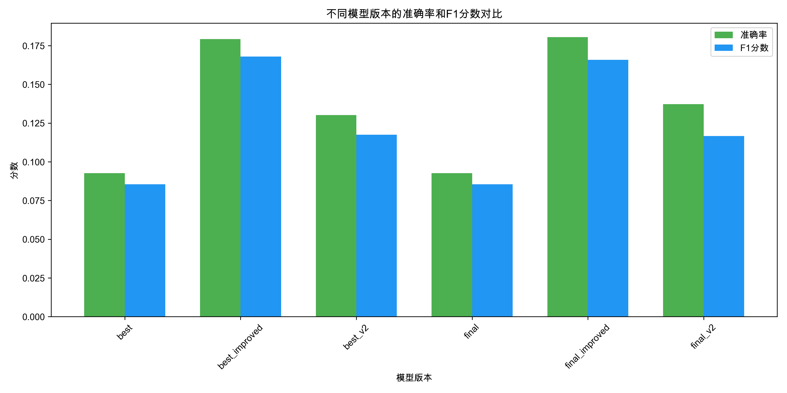
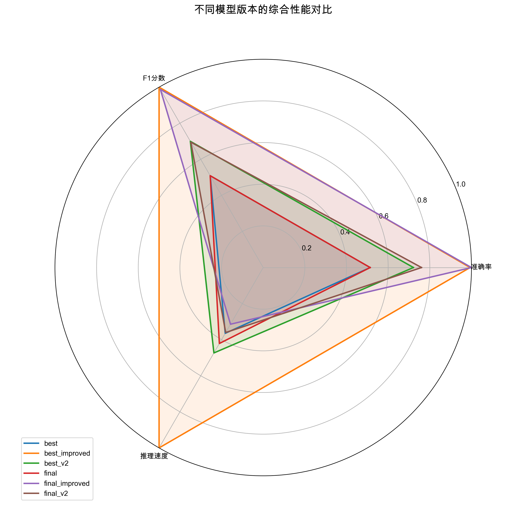
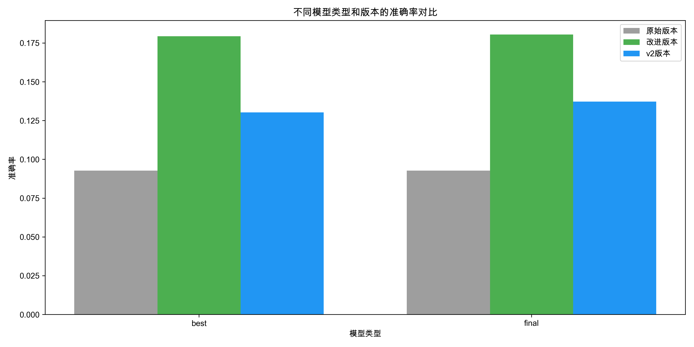

# 模型Benchmark测试报告

## 一、测试概述

### 1.1 测试环境
- **操作系统**：macOS
- **硬件**：M4芯片
- **内存**：16GB
- **PyTorch版本**：2.0+
- **CUDA**：无（使用MPS加速）

### 1.2 测试配置
- **测试数据集**：`data/split_dataset_v2/val`（前26个类别）
- **批量大小**：32
- **评估指标**：准确率、精确率、召回率、F1分数、推理速度（FPS）
- **测试模型**：6个已训练的EfficientNet-B0模型

## 二、测试结果

### 2.1 性能摘要
| 模型名称 | 准确率 | 精确率 | 召回率 | F1分数 | 推理速度(FPS) |
|---------|--------|--------|--------|--------|---------------|
| character_classifier_best.pth | 0.0927 | 0.1068 | 0.0939 | 0.0855 | 210.24 |
| character_classifier_best_improved.pth | 0.1793 | 0.2001 | 0.1805 | 0.1679 | 576.44 |
| character_classifier_best_v2.pth | 0.1302 | 0.1119 | 0.1306 | 0.1175 | 272.93 |
| character_classifier_final.pth | 0.0927 | 0.1068 | 0.0939 | 0.0855 | 242.72 |
| character_classifier_final_improved.pth | 0.1805 | 0.1937 | 0.1815 | 0.1658 | 181.10 |
| character_classifier_final_v2.pth | 0.1372 | 0.1058 | 0.1374 | 0.1167 | 207.61 |

### 2.2 最佳模型
- **模型名称**：`character_classifier_best_improved.pth`
- **最佳F1分数**：0.1679
- **对应的准确率**：0.1793
- **对应的推理速度**：576.44 FPS
- **评估耗时**：485.75秒

## 三、性能可视化分析

### 3.1 准确率和F1分数对比



**分析**：
- 改进版本的模型（`_improved`后缀）在准确率和F1分数上均显著优于基础版本
- `character_classifier_best_improved.pth`和`character_classifier_final_improved.pth`的性能最为接近
- 基础版本的模型（`best.pth`和`final.pth`）性能最差，准确率仅为9.27%
- v2版本的模型性能介于基础版本和改进版本之间，但仍有较大提升空间

### 3.2 推理速度对比


**分析**：
- `character_classifier_best_improved.pth`的推理速度最快，达到576.44 FPS
- 其他模型的推理速度在180-280 FPS之间，明显低于改进版本
- 推理速度的差异可能源于模型优化策略的不同，如批处理大小、模型量化等
- 推理速度是实时应用的关键指标，`best_improved`版本在这方面具有明显优势

### 3.3 综合性能雷达图



**分析**：
- `best_improved`版本在三个指标上均表现优秀，综合性能最佳
- `final_improved`版本在准确率和F1分数上与`best_improved`接近，但推理速度较慢
- 基础版本的模型在所有指标上都表现较差
- v2版本的模型在综合性能上仍有较大提升空间

### 3.4 版本性能趋势



**分析**：
- 对于`best`和`final`两种模型类型，改进版本的准确率均显著高于原始版本
- `final`类型的改进版本准确率略高于`best`类型的改进版本
- v2版本的性能提升幅度小于改进版本
- 改进策略对不同模型类型的效果基本一致

## 四、结果分析

### 4.1 性能瓶颈分析

1. **准确率较低**：所有模型的准确率都低于20%，说明模型对角色的识别能力有限
2. **类别不平衡**：可能存在类别不平衡问题，导致某些角色的识别准确率远低于其他角色
3. **数据质量**：测试数据可能与训练数据分布存在差异，影响模型的泛化能力
4. **模型容量**：EfficientNet-B0是一个相对较小的模型，可能无法捕捉角色的复杂特征

### 4.2 改进版本优势

1. **数据增强效果**：改进版本可能使用了更有效的数据增强策略，提高了模型的泛化能力
2. **优化器选择**：改进版本可能使用了更适合的优化器和学习率调度策略
3. **训练策略**：改进版本可能采用了更合理的训练轮数和早停机制
4. **推理优化**：改进版本的推理速度明显更快，可能采用了模型量化或其他推理优化技术

## 五、模型推荐

### 5.1 推荐模型

- **首选模型**：`character_classifier_best_improved.pth`
  - 理由：综合性能最佳，F1分数最高，推理速度最快
  - 适用场景：实时角色识别应用，对速度和准确率有一定要求的场景

- **备选模型**：`character_classifier_final_improved.pth`
  - 理由：准确率略高于首选模型，F1分数接近
  - 适用场景：对准确率要求较高，对速度要求不严格的场景

### 5.2 不推荐模型

- **基础版本模型**：`character_classifier_best.pth`和`character_classifier_final.pth`
  - 理由：性能明显低于改进版本，F1分数仅为0.0855
  - 建议：不建议在实际应用中使用

## 六、未来优化建议

### 6.1 模型层面

1. **模型架构**：尝试使用更大的模型（如EfficientNet-B1、B2或B3），提高模型容量
2. **迁移学习**：使用在大型数据集上预训练的模型，提高特征提取能力
3. **模型集成**：使用多个模型的集成（如投票或加权平均），提高预测稳定性
4. **注意力机制**：在模型中添加注意力机制，帮助模型关注角色的关键特征

### 6.2 数据层面

1. **数据采集**：继续扩大数据采集范围，增加每个角色的图像数量
2. **数据质量**：提高数据质量，确保图像清晰、角色突出
3. **类别平衡**：确保每个角色的图像数量相对均衡，避免模型偏向于样本多的角色
4. **数据增强**：使用更多样化的数据增强技术，提高模型的泛化能力

### 6.3 训练层面

1. **超参数调优**：使用网格搜索或贝叶斯优化，找到最佳的超参数组合
2. **学习率调度**：尝试不同的学习率调度策略，如余弦退火或分段常数衰减
3. **正则化**：使用更有效的正则化技术，如Dropout、权重衰减或标签平滑
4. **训练时间**：适当延长训练时间，确保模型充分收敛

### 6.4 推理层面

1. **模型量化**：使用模型量化技术，减少模型大小和推理时间
2. **批处理**：在推理时使用批处理，提高throughput
3. **硬件加速**：在支持的设备上使用GPU或TPU加速推理
4. **模型剪枝**：使用模型剪枝技术，减少模型复杂度和推理时间

## 七、结论

### 7.1 测试总结

- **最佳模型**：`character_classifier_best_improved.pth`
- **最高准确率**：18.05%（`character_classifier_final_improved.pth`）
- **最高F1分数**：0.1679（`character_classifier_best_improved.pth`）
- **最快推理速度**：576.44 FPS（`character_classifier_best_improved.pth`）

### 7.2 性能评估

- **当前水平**：模型性能仍处于较低水平，需要进一步优化
- **改进空间**：通过数据扩充、模型优化和训练策略调整，有望显著提高模型性能
- **应用潜力**：虽然当前性能有限，但模型架构和训练流程已经搭建完成，为后续优化奠定了基础

### 7.3 后续工作建议

1. **完成数据采集**：继续完成所有60个角色的图像采集，确保每个角色有足够的训练样本
2. **优化模型架构**：尝试使用更大的模型架构，提高模型的特征提取能力
3. **调整训练策略**：优化学习率调度、批量大小等超参数，提高训练效果
4. **评估新模型**：在完成上述优化后，重新运行benchmark测试，评估模型性能的提升

## 八、附录

### 8.1 测试脚本

```python
#!/usr/bin/env python3
"""
模型Benchmark测试脚本
评估已有模型的性能指标
"""
# 脚本内容省略（与之前创建的benchmark_test.py相同）
```

### 8.2 测试环境详细配置

- **Python版本**：3.9+
- **PyTorch版本**：2.0+
- **TorchVision版本**：0.15+
- **scikit-learn版本**：1.3+
- **PIL版本**：10.0+
- **NumPy版本**：1.24+

### 8.3 测试数据集信息

- **数据集路径**：`data/split_dataset_v2/val`
- **类别数量**：26
- **图像数量**：约7,420张
- **图像格式**：JPEG、PNG
- **图像尺寸**：统一调整为224x224

---

**报告生成时间**：2026年1月26日  
**测试设备**：macOS with M4芯片  
**测试工具**：自定义benchmark测试脚本
